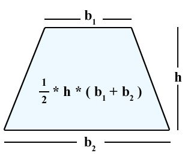
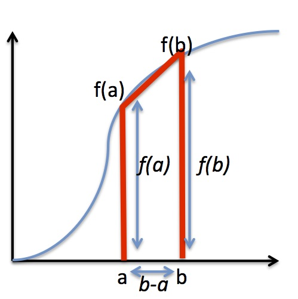

# Lab 03 - Functions

## Pagers and Help

### Pagers

Often, you want to be able to view files in the terminal (instead of opening them in a text editor like Atom or gedit). There are a few ways to view files from the terminal.

### `cat`

The command, `cat`, is short for "concatenate", which means to link things together. The `cat` program is often used to link the output from one program to the input of another. But. another useful trait of `cat` is to output the contents of a file to the terminal. Invoking the `cat` program is quite simple:

```bash
cat some_file_name.txt
```

The above command will print the contents of the file to the terminal. However, for large files, `cat` is not very user-friendly. You should use a pager instead...

### `less`

Pagers are programs that show you content one _page_ at a time. They are useful for viewing large files. The most popular pager is called `less` because it was derived from a program called `more`, computer science history is a little silly. You can invoke the `less` program like so:

```bash
less some_file_name.txt
```

To go the the next page, push the F key (forward) on your keyboard. To go back a page, push the B key (backwards). To quit the pager and return to the command line, push Q (use your imagination for why it is the Q key).

### Help

There are a few programs intended to provide documentation. However, they are often difficult to understand, especially for a beginner. You invoke them by typing the `help` command, and the name of the program you want information about. They may open up a pager if the entry is long.

### `help`

This command is used to provide information about `bash`, which is the language the terminal is running. Example:

```bash
help cd
```

### `man`

This command (short for "manual") is used to retrieve the documentation about the programs installed on the computer. Example:

```bash
man python
```

### `info`

This command is an alternative to `man`, often used by Unix distributions. Example:

```bash
info ls
```

### `-h`

Many programs will give you a bit of documentation about themselves (like what arguments they accept) if you invoke the program with the `-h` flag. Example:

<pre>python -h</pre>

⭐ Please show your TA the `man` entry for the program, `git`, then demonstrate paging forward and backward in the entry.

## Coding Assignment

### Background

You remember calculus, don't you? The basic concept of an integral is the area under a curve, with the curve represented by some function. If you can integrate a function, you can calculate that area directly. But, for some functions, it is easier to approximate that area using discrete, iterative methods. We are going to investigate one of those methods, the [Trapezoidal Rule](http://en.wikipedia.org/wiki/Trapezoidal_rule).

The basic idea is to draw a series of trapezoids that approximate the area under a curve, where the more trapezoids we draw, the better the approximation.

First, remember how to calculate the area of a trapezoid?

<center>



</center>

One measures the length of the parallel sides (`b1` and `b2`), then the distance between the parallel sides (`h`). Add the parallel distances, multiply those values by `h`, and divide by 2.

Let's rotate that trapezoid 90 degrees counter-clockwise. Now, the `b1` length is `f(a)`, the `b2` length is `f(b)`, and the height, `h`, is `b - a`.

<center>



</center>

Given the above, the area becomes: 

`((b - a) * (f(a) + f(b))) / 2`

For two trapezoids next to each other with heights `f(a)`, `f(b)`, and `f(c)`, with `f(b)` as the common side used by the two trapezoids, we obtain the formula:

`(((b - a) * (f(a) + f(b))) / 2) + (((c - b) * (f(b) + f(c))) / 2)`

In general, for some definite integral:
1.  over the region `a` to `b`,
2.  with `n` equally spaced trapezoids (`n + 1` points on the x-axis),
3.  and grid spacing of `h = ((b - a) / n)`:

<center>

 


</center>

### Program Specifications

There is a Mimir assignment associated with this lab for testing purposes.

1.  Write three helper functions:
    1.  A function named `fn()` (with signature `double fn(double x)`) to integrate over. We'll use -6x^2 + 5x + 3 for this assignment.
        1.  Takes a single `double` argument, parameterized as the value, `x`.
        2.  Returns type `double`, which is simply the result of substituting `x` into the formula
    2.  A function named `integral()` (with signature `double integral(double x)`), which is the actual integral of `fn`, -2x^3 + (5/2)x^2 + 3x
        1.  Takes a single `double` argument, parameterized as the value, `x`.
        2.  Returns type `double`, which is simply the result of substituting `x` into the formula

    ⭐ Please show the TA your `fn()` and `integral()` functions before moving on.

    3.  A function name `trapezoid()` (with signature `double trapezoid (double a, double b, long n)`).
        1.  Takes three parameters:
            1.  The two definite points of the integral, `a` and `b`, as `double`.
            2.  The number of trapezoids, `n`, a `long`.
        2.  Calculates the area under the curve represented by the function `fn()`, given the provided number of trapezoids over the interval `a` to `b`.
        3.  Returns the sum of the area of the trapezoids as type `double`.
2.  A `main()` function that does the following:
    1.  Takes in four values from the user (`std::cin`), in order:
        1.  A lower range of x, `a`
        2.  A higher range of x, `b`
        3.  A float `tolerance` value
        4.  An initial guess at the number, `n` (the number of trapezoids)
    2.  You run a loop that measures the difference between the actual value of the integration (you have the `integral()` function so you can calculate the exact value between `a` and `b`) and the estimated value from `trapezoid()`
        1.  If the difference is within `tolerance`, report to the user:
            1.  `n`
            2.  The estimate value
            3.  The exact value
            4.  The `tolerance`
        2.  If the difference is not within `tolerance`, _double_ the value of `n` and re-run. Continue the doubling and re-running until the estimate of the `trapezoid()` function is within `tolerance` of the actual value from `integral()`.

All flointing point output should have 4 decimal places of precision.

**Hint**: You might want to consider a do-while statement and the `std::abs` function (from the `cmath` library) in your `main()`.

### Example Output

```
Lower Range: 0
Upper Range: 1
Tolerance: 0.01
Initial trapezoid count: 1
Intermediate Result:2.5000, traps:1, diff:1.0000
Intermediate Result:3.2500, traps:2, diff:0.2500
Intermediate Result:3.4375, traps:4, diff:0.0625
Intermediate Result:3.4844, traps:8, diff:0.0156
Trap count:16, estimate:3.4961, exact:3.5000, tolerance:0.0100
```

⭐ Please show the TA your working program.
