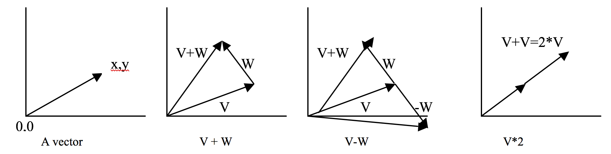

# Lab 09 - Classes

**Warning**: Parts of this lab cannot be seen with GitHub dark mode or a dark mode browser extension enabled.

## Remote Access

Often, you'll want to be able to connect to, and run programs on computers that you don't have a keyboard attached to. You _already_ do this when connecting to a network over the internet. The primary means that you use to connect to computers at the command line is a tool called "SSH". SSH allows you to authenticate (usually via your username and password) to a remote computer so you can access its command line.

The `scp` command allows you to copy files to and from your local computer with a remote one.

The remote computer that you all have access to is called "chuck.egr.msu.edu", and your authentication credentials are your MSU NetID, and EGR password (_not_ your CSE password). Note that, because this class has transitioned away from using DECS servers to Mimir, you may be unable to access the Chuck server. Certain countries are firewalled as well, unfortunately.

[Read this tutorial from The New Stack](https://thenewstack.io/linux-lesson-copy-files-over-your-network-with-scp/).

⭐ Show your TA the hypothetical command you would run to copy a file, named 'test.png', on your laptop's Downloads folder to your CSE account's Desktop.

## Coding Assignment

We are going to work on making our own data structures using a C++ `struct`. More specifically, we are going to create some sample member functions for a two-dimensional, euclidean vector, represented as a `struct` named `MathVector`.

### Background

A vector can be thought of as an arrow that has some varying magnitude and direction. It is usually represented by an  pair (referred to as the _components_), where the starting point of the vector is assumed to be at , with the head of the vector meeting at coordinates .

<div align="center">
    
</div>

Below are some of the operations that can be performed on a vector, all of which you'll ultimately implement for your `MathVector` `struct`.

For the following examples, let:

<div align="center">

</div>

<div align="center">

</div>

#### Vector Addition

The addition of two vectors returns a new vector whose components are the sums of the operand vectors' components applied parallely.

<div align="center">

</div>

&nbsp;

#### Vector Multiplication

Vector multiplication can be done in _many_ ways depending on the second operand. We'll focus on, and implement two of these.

When a vector is multiplied by a scalar (i.e., any number), it becomes _scalar multiplication_, where the scalar is simply multiplied against every component of the vector to compose a new vector.

<div align="center">

</div>

&nbsp;

When two vectors are multiplied together, the components are multiplied parallely and summed to return a scalar value (_not_ a new vector). This is called the _dot product_ (there is also a _cross product_, but we won't be doing that for today).

<div align="center">

</div>

&nbsp;

#### Vector Magnitude

A vector's _magnitude_ (AKA its length) can be calculated using a simplified version of the euclidean distance formula. This, again, does not return a new vector -- it returns a scalar value.

<div align="center">

</div>

&nbsp;

### Program Specifications

[Download the starter code provided here](../.assets/downloads/lab09.zip).

Your task is to create an implementation file (named "math_vector.cpp") that provides the algorithm for all of the member functions shown below (and inside the header file).

Note that some of the work has been done for you. Here is what has been completed so far:

`MathVector` has two data members:
- `long x`, represents the x component of the vector
- `long y`, represents the y component of the vector

The `MathVector` constructor has two declarations:
- A `default` constructor that initializes the data members, `x` and `y`, to 0.
- A two-parameter constructor that takes an input x and y component and assigns them to the `x` and `y` data members, respectively.

You are to _implement_ the following functions in your math_vector.cpp file:

&nbsp;

```c++
string vec_to_str(const MathVector &v)
```

Takes a `MathVector` instance and returns a `string` representation of the `MathVector` in the format "`x:y`".

_This is not a member function, it is a generic function_.

&nbsp;

```c++
MathVector add(const MathVector &other)
```

Takes a second operand `MathVector` instance, `other`, and adds them to produce a new `MathVector` instance.

⭐ Show the TA your functioning `add()` method before moving on.

&nbsp;

```c++
MathVector mult(long a)
```

Multiplies the `MathVector` instance by a scalar, `a`. Returns the resultant `MathVector` instance.

&nbsp;

```c++
long mult(const MathVector &other)
```

Takes the dot product between the two `MathVector` instances. Returns the resultant `long`.

&nbsp;

```c++
double magnitude()
```

Takes the magnitude of the `MathVector` instance. Returns `double`.

⭐ Show the TA your completed `MathVector` class.