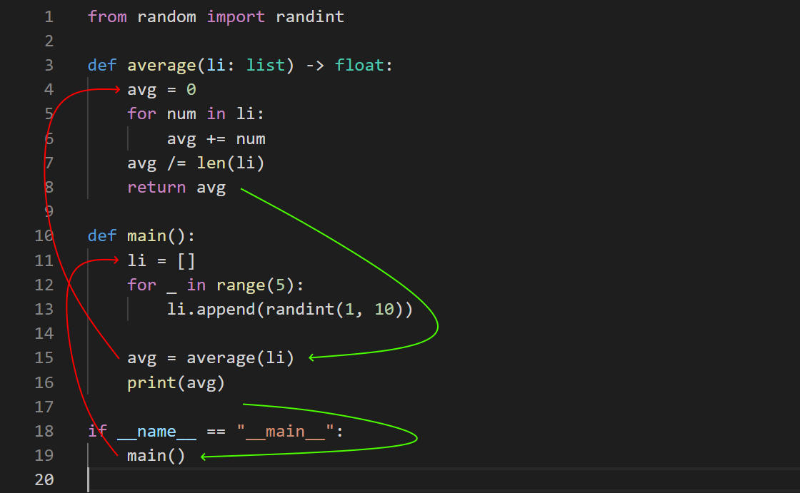
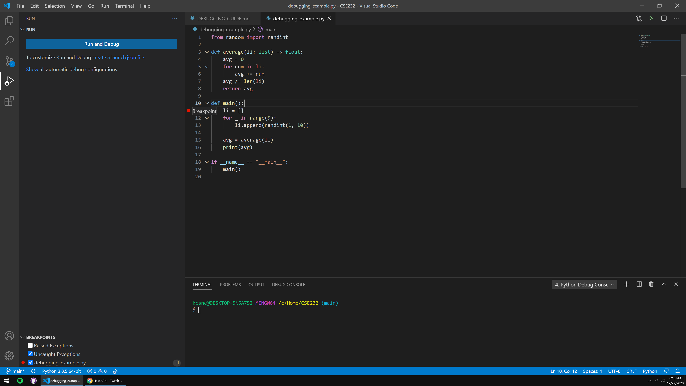
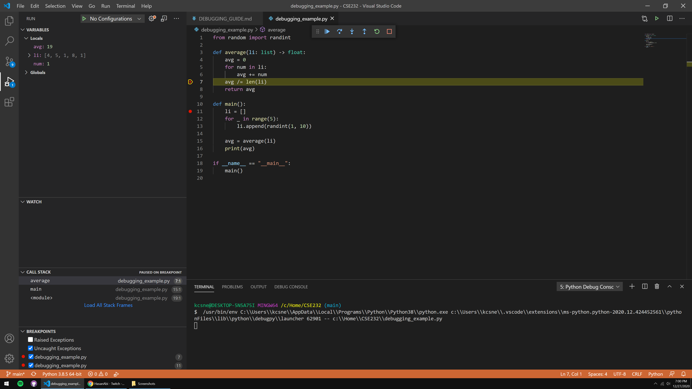
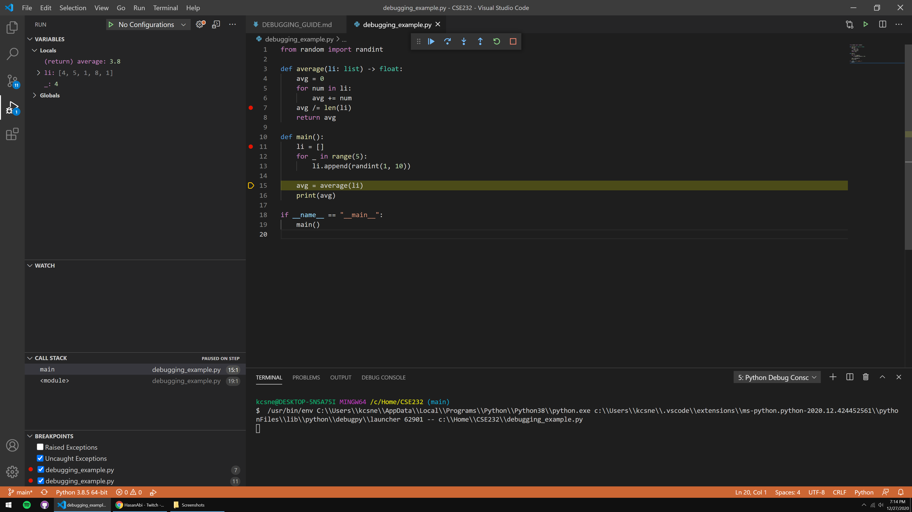

# Debugging Guide

If you weren't taught how to use a debugger in your previous programming class, or you just need a refresher, you've come to the right place -- this is a debugging guide. I'm using Visual Studio Code with Python in this demonstration, but, the same principles will apply to most other code editors, and all other languages.

If you're coming from CSE231, you're probably familiar with [PythonTutor](http://pythontutor.com/). A debugger is like PythonTutor, but integrated within your code editor and not limited to being inside the browser.

We *highly* recommend that you become acquainted with a debugger for this course and for your computer science/engineering career in general. That being said, *you could* go through this course without knowing how to use one, but, you'd only be making it harder for yourself.

## Control and The Call Stack

Before we discuss the debugger, however, it's important to preface the foundational aspect of any program, i.e., how programs run.

No matter the programming language, the **control** of the program will always attempt to go as far down the script as it can. When control has reached the bottom of the script, where no other statements are present, that's when control has officially ended, meaning that the script terminates. Control can go *up* the script by using loops or functions, but it will naturally try to climb back down.

For an example, let's take this simple Python program that calculates the average value of a list of random integers:

<div align="center">
    
</div>

The first series of steps we would expect to take, here, would be the defining of imports and functions, correct? Otherwise, we wouldn't be able to call `average()` or `randint()` in `main()` as we're doing right now.

And, you'd be correct in this assumption. This is why we always put imports at the top, with function definitions following it.

<div align="center">
    
</div>

The red line, here, shows the control flowing from the top of the script to the furthest point it can go down. We import `randint()`, define our two user-made functions, and then we call `main()` in the global namespace -- meaning that we now jump *into* `main()` to run its code.

<div align="center">
    
</div>

The `main()` function then has a multitude of steps to get through. We define a list, and append five random integers to it. Control is still flowing as far down as it can, but the for-loop will bring control back up for five iterations.

We then continue down to line 15, where we call the `average()` function. Like `main()`, control will still try to go as far down as possible, it's just that we're preventing it from doing so by re-routing it to different places.

If we generalize a bit, this is what we should expect:

<div align="center">
    
</div>

`main()` is called from the global namespace, we run `main()`'s code until it hits `average()`, `average()` returns back a value to `main()`, where we then run the rest of `main()`'s code until we return back to the global namespace.

The way your computer tracks these nested function calls is through what's referred to as the **call stack**. You can think of the call stack as being a stack of books where each book represents a function. We place the `main()` book first, read through some of it, then place the `average()` book on top of the `main()` book on line 15. In order to get back to reading the `main()` book, we have to read the `average()` book on top of it to take it off the stack and get back to reading the `main()` book.

These principles on control and the call stack apply to *all* programming languages. And, if you understand it well, then the debugger will make a lot more sense to you.

## Terminology

There are some terms you'll need to be familiar with before jumping-in. You'll see practical demonstrations soon.

- **Breakpoint** - A marker set by the programmer at a particular line of code that indicates where program control should halt until the next command dictated by the programmer.
- **Step/Stepping** - Executing the program line-by-line.
- **Continue** - A command that runs program execution until the next breakpoint, or until the program ends.
- **Step Over** - A command that executes one line of code without going into any function that line might be invoking.
- **Step Into** - A command that executes one line of code and goes into any function that line might be invoking.
- **Step Out** - A command that runs the function when control has stepped into one, bringing control back to the line that called the function via its return.
- **Restart** - A command that re-executes the program from the beginning with the debugger active.
- **Stop** - A command that exits the debugger and halts program execution entirely.

## Demonstration

I would encourage you to follow-along with this demonstration on your own code editor. [You can install Python here](https://www.python.org/) if you don't have it. On VSCode specifically, you'll also want to install the "Python" extension by Microsoft, which can be found in the extensions marketplace.

```python
from random import randint

def average(li: list) -> float:
    avg = 0
    for num in li:
        avg += num
    avg /= len(li)
    return avg

def main():
    li = []
    for _ in range(5):
        li.append(randint(1, 10))
    
    avg = average(li)
    print(avg)

if __name__ == "__main__":
    main()

```

On most code editors, you can set a breakpoint by clicking directly to the left of a line number. This is often represented as a red dot.

Since we know that control will ultimately reach the `main()` function, let's place a breakpoint on its first line.



To run our program with the debugger enabled, you can hit F5 (on VSCode) to see that our program halts at the breakpoint we just set, represented by the yellow highlight.


This yellow highlight also represents the next line to be ran by command of the programmer. But, how do we give commands?

At the top, you'll see that a tiny control panel appears when the debugger is active:

<div align="center">
    
</div>

These options are the "commands" described in the [Terminology](#terminology) section. We have, in order: Continue, Step Over, Step Into, Step Out, Restart, and Stop.

Try hitting the Step Over button slowly until you reach line 15 (but don't execute the line just yet), paying attention to the VARIABLES panel on the left side.


Hopefully you saw `li` slowly expand with new random integers every time you stepped. After control has flowed beyond the for-loop, you can click `li` in the VARIABLES panel to see the list's content, conveniently denoted by index.

This is one of the most powerful features of the debugger -- being able to see your data structures as they're being built in realtime. This can help diagnose issues with your code, and it can help with visualizing how your structures are setup if you have complicated, nested constructs.

Moving on, then, we have a few options on line 15. We could Step Over again, which would bring us to line 16, or we could Step *Into* to see how our `average()` function is running -- let's hit Step Into once.


We're now inside `average()`, with the `avg = 0` expression being the next line to run. Now, what's going to happen here?

We should expect that lines 5-6 are going to go through every element of the list, adding each to the variable, `avg`. Since we know what's going to happen here, and we're confident that this code will run properly, let's place another breakpoint at line 7 and hit Continue to *skip* the amount of steps taken on lines 5-6.



This is the main purpose of the Continue command -- skipping sections of code that we know are going to run properly. What would happen if we *didn't* set a breakpoint at line 7? 

Well, we'd calculate the average, return back to `main()`, print the average, and return back to line 19. This is another property of the command -- Continue will run program execution either until there's another breakpoint, or until the program terminates. Be careful with how you use Continue, ensure that your program's control *will* hit another breakpoint eventually if you don't want the program to simply end.

Up next, we see that `avg` is going to be divided through by the length of `li`, and returned back to the caller. If we're confident that the rest of this function is going to do its job properly, let's hit Step Out to execute the rest of the function we're in and return back to `main()`.



You can see in the VARIABLES panel that VSCode tells us the return value from our function (3.8, in my case), and if we Step Over once...


...our `avg` variable in `main()` obtains that value, since we assigned it to the call of `average()`. Pretty neat!

This is the primary application of Step Out. If we're inside a function, we can let the rest of the function do its thing, eventually leading back to the caller of that function.

After this, we're pretty much done! The last line to run is `print(avg)`, where control has officially ended afterwards since there's nothing else below the lines:

```python
if __name__ == "__main__":
    main()
```

There are two commands I didn't showcase here, that being Restart and Stop. These two are pretty self-explanatory. Restart will stop your current debugging session and re-execute the program from the beginning with the debugger, and Stop will simply halt the debugging session and your program entirely.

You'll notice that there is no way to "Step Back" a line like there is on PythonTutor, for instance. I don't think there's an IDE debugger that has that feature (though I could be wrong) -- the best substitute would likely be to set a breakpoint on a prior line and hit Restart. 

To avoid the need of having some sort of Step Back command, you should **always** think ahead on where your program's control will lead. **Set expectations** on what you believe should happen when you run a particular line or set of lines, and deduce the problematic expressions from there.

Hopefully you found this guide helpful! Please don't hesitate to ask about the debugger on Piazza.
