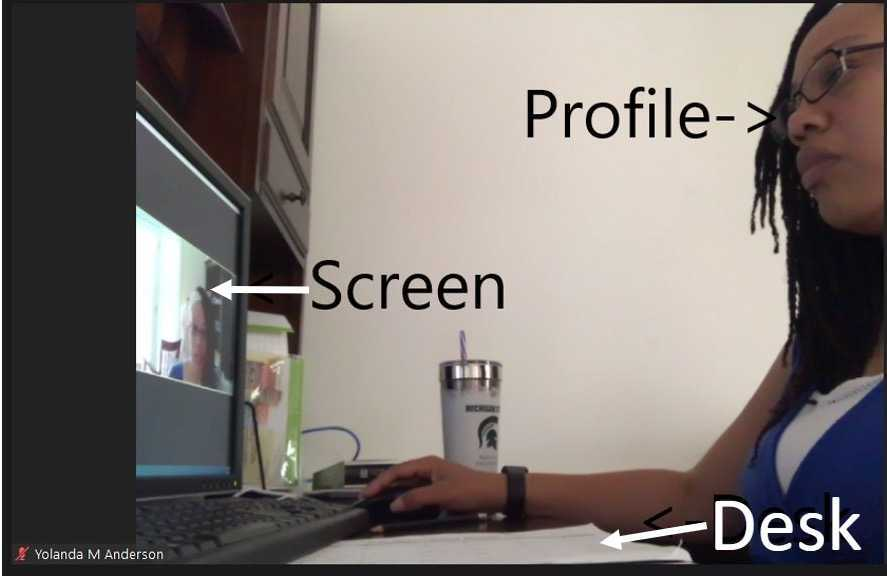

# Exam Policies

## Midterm Exam Details

Offerings:
- Wednesday Morning: 2023-03-25 10am-noon
- Wednesday Evening: 2023-03-25 7pm-9pm

Location: <https://msu.zoom.us/j/94955751228>

<!-- ## Final Review Session

In the Exam Zoom Meeting on 2021-04-23 at 4pm, Dr. Nahum will host a final review session to go over the sample final exam and answer any questions about the exam or other aspects of the class. It will be recorded and is entirely optional to attend. The solutions to the sample final will only be given to the students that "submit" their solution prior to the review session, so please ensure that you do so if you care to get answers. 
## Midterm Exam Details

Time:
- Lab Sections 1-3: Wednesday, 2022-03-23 @ 9-11am
- Lab Sections 4-8 and 730: Tuesday, 2022-03-22 8-10pm

Location: <https://msu.zoom.us/j/94955751228>

## Final Exam Details
- Lab Sections 1-5: Wednesday, 2022-05-04 @ 7-9pm
- Lab Sections 6-8 and 730: Thursday, 2022-05-05 @ 10am-noon 

Location: <https://msu.zoom.us/j/94955751228>
-->

## Logistics
The exams are password protected and can only be accessed during the allotted time. 

Both exams will be 90 minutes in duration (from timer start to timer end), but everyone needs to be present in the Zoom meeting at the start of the scheduled exam time to ensure that everything is setup properly, ID checks and to deliver the password.

If you can't make an exam time, please respond to the Piazza post announcing the exam indicating that you need to attend the alternative exam offering.

As just stated, for students that have conflicts with both exam times, please respond to the Piazza post announcing this exam. We will need to schedule a 60 minute one-on-one oral exam as an alternative during the week of the exam. Do note that you need to announce a valid time conflict with both exam times ASAP to be eligible for the alternative exam. If you have university-approved accommodations (VISA), please inform us of them on that Piazza announcement.

You'll need to use the Zoom app on a separate device with a camera (likely a phone or tablet) that can show your workspace and computer screen. You will obviously need a computer from which to take the exam, which will be a D2L Quiz.

Please ensure that your screen, workspace and profile are visible by the Zoom device throughout the exam. Example:

    

## Rules

- During the exam, you are only permitted to communicate with instructors. Only communicate to them via private Zoom messages. Please ensure that all other messaging platforms are disabled during the exam.
- The exam's D2L page is the only application that you're allowed to have open. The Zoom device can only have the Zoom app open to display your workspace and message instructors.
- You are welcome to use any non-electronic resource during the exam. This includes textbooks, printed lecture slides, notes, example solutions to homework (including instructor solutions), and birthday cards. You may **not** use any online reference material or any other electronic resource.

## Preparation

Prior to the exam, a sample version will be released with questions broadly similar to the actual exam. A key will also be provided (within a few days). The best way to prepare is to solve the sample exam, on your own, with the material you intend to bring to the actual exam. If you can't solve a question, come to help room, or ask on Piazza. We recommend that only after solving the exam, should you look at the solutions.

## Cheatsheets and Exam Aids

The exam is open book, meaning that you can bring whatever material you want, so long as it's not electronic. Printouts of reference material, textbooks, notes, the sample exam and key, etc. are all fine to bring.

I recommend bringing reference material on the topics that are hard to remember. For the final, you might consider the useful functions in the STL algorithm library and the many data structures (`std::vector`, `std::string`, `std::map`, `std::set`, etc.).

## Content

Both the midterm and final exam are comprehensive. This includes material from lectures, labs, and homework. The midterm exam will cover content up to and including Week 05. The final exam will cover everything.

## Past Exams

[All of the past in-person exams can be found here](https://cse.msu.edu/~cse232/Exam_Content/). Though, content on old exams won't necessarily be relevant to this semester's exams, as the course has evolved over time.

These old exams were also given as traditional paper exams. Since exams are now taken on Coding Rooms, do note that question styles will differ.
