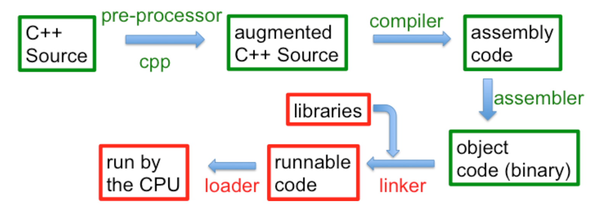

# Lab - Vectors and Multi-File Compilation

## Miscellaneous Bash Stuff

### Command Completion

A common mistake when writing in any programming language is that of typos. One way to avoid them is to use an autocompletion feature so you don't have to type out a full name or variable. When you hit the TAB key, the terminal attempts to fill the rest of the command/file name you are typing. If there isn't a unique match (for instance, you are typing: `cp fi` and then hit TAB when there are files with the names "file_01" and "file_02" present), it will fill in as much as it can (in this case "`cp file_0`"). If you hit TAB again, the terminal will present the potential options that it can autofill with. You can specify more characters until a unique match is found.

Example:

```bash
cp f                # hit TAB
cp file_0           # hit TAB
cp file_02 f        # hit TAB
cp file_02 file_0   # hit TAB
cp file_02 file_01  
```

I recommend making use of TAB completion. We, humans, are prone to making typos, where our computer friends are not.

### `history`

The terminal remembers each command you type into it in its history. When you execute the `history` command, the terminal will report each command run with a number. Example:

```bash
  495  ls
  496  cd ../../
  497  ls
  498  ls
  499  cd ..
  500  cp file_02 file_01
  501  history
```

You can run a command from your history by noting its number. For instance, `!500` will run the `cp file_02 file_01` command again.

You can also use the `!!` command to re-execute the latest command.

### Configuration (.bashrc and .bash_profile)

Sometimes, there are bash commands you always want to run before you get to work. Perhaps, you want your terminal to configure some settings, or tell you how much disk space is left on the computer. To make this easier, there are two config files that bash looks for (in your home directory).

You `.bashrc` file is a bash script that runs every time you invoke the `bash` command (example: `bash my_script.sh`) and when you login. Your `.bash_profile` file is a script that runs when you login to your user account. Both of these are used to execute bash commands that set up your environment.

Your PATH is a list of directories that bash (or tcsh, which is the default on the lab computers) looks in when trying to run a command. Bash looks through every folder in the list (in order), trying to find a program named identically to your command input.

You can see your path by `echo`'ing it to the screen with:

```bash
echo $PATH
```

In the bash and tcsh shells, it outputs something like:

```
/soft/linux/bin:/bin:/usr/bin:/usr/sbin:/usr/X11R6/bin:/usr/cpssbin:/soft/linux/bin:/usr/X11R6/bin:/usr/local/bin:
```

This means that if I try to run `say_hello Josh`, it looks in `/soft/linux/bin` for an executable called `say_hello`, and if it can't find it, it then looks in `/bin`, then in `/usr/sbin`, and so on before giving up (the `:` character delimits the paths).

Sometimes it is useful to add other directories to this path (often for programs you want to call from the command line).

If I want to add the folder "`~/joshs_programs/`" to my PATH, because it has useful programs to run at the command line, I can add them like this:

```bash
export PATH=$PATH:~/joshs_programs      # for bash
```

```tcsh
setenv PATH $PATH\:~/joshs_programs     # for tcsh (on lab computers)
```

However, this change to the PATH will only last as long as your terminal session lasts (when you log out, it'll be gone). You'll want to add that line to your .bashrc or .bash_profile (or .tcshrc) config file if you want that in your path for future sessions.

⭐ Add the Desktop to your PATH and `echo` your PATH for the TA.

## Multi-File Compilation

Imagine that you've written a really useful function. You would like to package that function individually so you can use it in other programs. The hard way to accomplish that would be to copy that function into every new program where you might want to use it. A better idea would be to place that function in its own separate file, and then compile any new program and your trusty function into one executable. That would be lovely!

Remember this picture?

<div align="center">

</div>

`g++` (the underlying compiler) does all of these steps rather invisibly. To take advantage of it, we'll need multiple files.

### Header Files

If we are going to define a function in one file, and use that function in a separate main file, we are going to have to find a way to inform the main file about the _types_ of that function. That is, we have to tell the main file:
- The function's name,
- The type it returns,
- And the types of each parameter

The _name_ of each parameter is unimportant. It can be given, changed in the main file, or left-out. All that matters is each parameter's _type_.

If we tell the main file this information, that is enough for the C++ compiler to check that the function is being used correctly, and by "correctly", I mean that the main file is using all of the _types_ correctly in calling the function, even though it does not yet have the actual function _code_.

Providing this information is the job of a **header file**. Header files are typically written with a ".hpp" or ".h" extension, and are used to indicate the type information for C++ elements (functions, classes, or some other C++ thing). This header file is used by the compiler to ensure that, now matter who is using this function, they are at least using the types correctly. Thus, without the full function definition, we can know that we followed the compiler rules and used the correct types and thus we know that this function call can later be plugged into (or "linked to") the function body.

### Example

Make a new folder somewhere, and call it "lab_vector" (either with your File Explorer or the command line).

If you don't remember, you can make an empty folder by using the `mkdir` command (on Unix):

```bash
mkdir lab_vector
```

[Download, and extract the files in this .zip folder linked here](../assets/downloads/lab_vectors.zip). Copy these files into your lab folder.

Navigate your terminal to the folder, then, compile your three files with the following command:

```bash
g++ -std=c++17 -Wall *.cpp
```

This command will compile all of the .cpp file (`*` means all, `*.cpp` means all files ending in .cpp) and build an executable.

### Some Warnings

It's nice that the previous command compiles all of the files, but if you have other .cpp files (like from different projects, or from things you were working on temporarily, etc.) it won't work. Instead, you must specify the list of files to use. You can even name your executable using the `-o` flag, to be something other than the default "a.out".

```bash
g++ -std=c++17 -Wall file1.cpp file2.cpp file3.cpp -o namedExecutable.exe
```

Something important to note, is that __we never compile header files__ directly. Header files should only be used when they are included in .cpp files.

⭐ Show the TA that you downloaded the three files, compiled them, and successfully ran the executable.

### The Files

The file extra.cpp defines the function, `extra()`, which will be used in the main.cpp program.

extra.hpp is the header file. Notice that it only provides the declaration of the function. In the declaration, the names of the parameters are not required, only their types. **Note that the function declaration ends in a semicolon, don't forget!** There are some weird `#` statements, as you probably noticed. We'll get to those in a bit.

The main.cpp file sets up the main program. Notice that it has the following statement in it:

```c++
#include "extra.hpp"
```

This means that the main program is _including_ the declaration of the function so that the compiler may check the type use of `extra()` by main.cpp. Pay attention to the quotes; when the `#include` expression uses quotes, it is assumed that the .hpp file is in the same directory as the other files. Include statements with angled-brackets (`<>`) denote the "standard include place" to the compiler. Since it is our own include file, we need to use quotes for it.

### The `#` Symbol

Anything beginning with `#` is part of the C++ pre-processor. The pre-processor sets up the files before the regular compilation starts, often adding additional information.  The `#include` command, for example, takes the target file and places it into this file and then starts processing it, possibly including other files or following other pre-processor directives.

The top of extra.hpp file starts with a comment and then has some pre-processor directives to prevent a multiple definition error. What do these do? Well, what if we wanted to use `extra()` in more than one file? Every file that uses `extra()` should include the extra.hpp file. However, you cannot declare a variable more than once, and the same is true for a function. If we have multiple includes in a file, and those files have includes, it is possible that we will including extra.hpp multiple times. But if the `extra()` function is declared multiple times in this single executable, C++ would complain.  Fortunately, there is a better solution than having to carefully craft our programs to ensure that each file is included only one.

The way around this problem involves three pre-processor statements:

```c++
#ifndef SOME_VARIABLE_NAME
#define SOME_VARIABLE_NAME

/*
put all *declarations* here
*/

#endif
```

This means: "if the pre-processor variable we indicate (`SOME_VARIABLE_NAME`) is not defined (`#ifndef`), go ahead and define it (`#define`) for this compilation and do everything else up to the `#endif`, (i.e., include these declarations in the compilation). If the variable is already defined, skip everything up to the `#endif` (i.e., skip the declarations)."

Thus, whichever file pulls in the header file first, defines the pre-processor variable and declares the function for the entire compilation. If some other file also includes the header file later in the compilation, the pre-processor variable is already defined, so the declarations are not included.

Of course, the simpler solution is to make use of `#pragma once`. Unfortunately this directive is not technically part of the C++ standard, so compilers are not guaranteed to know how to use it.  That said, all major modern C++ compilers do have it implemented properly.

If you use the `SOME_VARIABLE_NAME` approach, you should make sure to use a consistent style for your project.  It is typically an all caps variable, the indicated the project or directory name and the filename that it is protecting.  This for extra.hpp we could have used something like `LAB_VECTORS_EXTRA_HPP`.

## Coding Assignment

Make a new folder in your lab directory called "splitter", and add three new files to it: main.cpp, functions.cpp and functions.hpp.

&nbsp;

```c++
vector<string> split(string const &s, char sep=' ')
```

The `split()` function should take in a `string` and return a `vector<string>` of the individual elements in the string that are separated by a given separator character (default of `' '`). Examples: 

`split("hello mom and dad")` should return `{"hello", "mom", "and", "dad"}`

`split("1,2,3,4", ',')` should return `{"1", "2", "3", "4"}`

Open functions.hpp, and store the function declaration of `split()` there. The declaration should be the snippet of code above **with a semicolon at the end, don't forget!**.

As discussed in lecture, default parameter values **go in the header file only**. The default does not occur in the definition if it occurred in the declaration.

This header file should wrap all declarations using the `#ifndef`, `#define`, and `#endif` pre-processor statements, as discussed above. Make up your own variable name.

Open functions.cpp, and write the definition of the function, `split()`, there. Make sure it follows the declaration in functions.hpp. The parameter names do not matter, but the types do. Make sure the function signature matches for both the declaration _and_ definition.

You can compile functions.cpp (not build, at least not yet) to see if functions.cpp file is well-formed for C++. It will not build an executable, but instead a .o (object) file. The object file is the result of compilation before building an executable -- an in-between stage.

⭐ Show your TA the object file generated after compiling the functions.cpp file.


```c++
void print_vector(ostream &out, vector<string> const &v)
```

This function prints all the elements of `v` to the output stream, `out`. Note that `out` and `v` are passed by reference.

Store the function in functions.cpp, and put its declaration in functions.hpp like you did for `split()`. **Don't forget the semicolon!** at the end.

Compile the function (not build, compile) to make sure it follows the rules.

**Note**: `ostream` is a category of all possible output streams (streams like `cout` and `ostringstream`). This function should be invoked with a specific `ostream` (either `cout` or `ostringstream`).

Your `main()` function should go in main.cpp.

In main.cpp, be sure to `#include "functions.hpp"` (note the quotes). This makes all of the functions in functions.hpp available to main.cpp. 

Write a `main()` function that:
1. Prompts for a string to be split
2. Prompts for the single character to split the string with
3. Splits the string using the `split()` function (which returns a `vector<string>`, remember)
4. Prints the vector using the `print_vector()` function

Compile (not build) main.cpp to see that it follows the rules. If you've successfully compiled it, build the project with the output executable name as "main" to test everything.

⭐ Demonstrate a working "main" executable to your TA.
### Assignment Notes

1. Consider using the `getline()` function for your implementation of `split()`.
    - `getline()` takes a delimiter character as a third argument. In combination with an input string stream, you can use `getline()` to split the string and `push_back()` each element onto the vector. 
    - Example: a call to `getline(stream, line, delim)` gets the string from `stream` (could be an `istream`, `ifstream`, `istringstream`, etc.) up to the end of `line`, or the `delim` character.

2. Default parameter values needs to be set at **declaration time**, which means that the default value for a function parameter should be in the header file (where the declaration is). If it is in the declaration, it should not be in the definition.

## Honors Material - CSV Redux!

In lab 05 we build a reader that could load a CSV file and print out a specific column.  For this lab, we're going to expand on that idea and write a program that will rotate a CSV file, swapping rows and columns.

### Background

In the previous section of this laboratory you worked with vectors that held a collection of strings. For this portion you are going to need to load in a whole table to data and output an flipped table.

For example, if you loaded in a table of CSE 232 helproom hours, it might look like this:

```csv
Monday,Tuesday,Wednesday,Thursday,Friday,Saturday,Sunday
"9-11am,5-9pm","9-11am,5-7pm","9-11am,5-7pm","9-11am,5-9pm","9-11am,5-7pm",5-7pm,5-7pm
```

When converted to a proper table this would appear as:

| Monday | Tuesday | Wednesday | Thursday | Friday | Saturday | Sunday |
| 9-11am,5-9pm | 9-11am,5-7pm | 9-11am,5-7pm | 9-11am,5-9pm | 9-11am,5-7pm | 5-7pm | 5-7pm |

But wouldn't it look nicer if the days were in one column and the times were in a second?  To do that, we would need to flip the contents of the CSV file.

Our goal would be to have the file look like this:

```csv
Monday,"9-11am,5-9pm"
Tuesday,"9-11am,5-7pm"
Wednesday,"9-11am,5-7pm"
Thursday,"9-11am,5-9pm"
Friday,"9-11am,5-7pm"
Saturday,5-7pm
Sunday,5-7pm
```

Or as a table:

| Monday | 9-11am,5-9pm |
| Tuesday | 9-11am,5-7pm |
| Wednesday | 9-11am,5-7pm |
| Thursday | 9-11am,5-9pm |
| Friday | 9-11am,5-7pm |
| Saturday | 5-7pm |
| Sunday | 5-7pm |

When considering how to implement a table flip, we first need to consider how to store a table in memory in C++  As it turns out, an `std::vector` can hold any type in it, including another `std::vector`.  So the type that you want to use for your tables is `std::vector<std::vector<std::string>>`.  Each entry is an std::string.  Each row is a vector of strings.  And then the table as a whole is a vector of vectors of string.

Don't want to type that much?  In C++ you can use the `using` command to create a type alias.  For example, we can have:

```c++
using table_row_t = std::vector<std::string>;
using table_t = std::vector<table_row_t>;
```

And thereafter, we can use the types on the left side (`table_row_t` and `table_t`) to represent the types on the right side.  And these new type names are even more informative for what we're trying to do with them.

### Assignment

You will write three helper functions and a program that will flip a CSV file.

The first helper function is 

### Trivia
