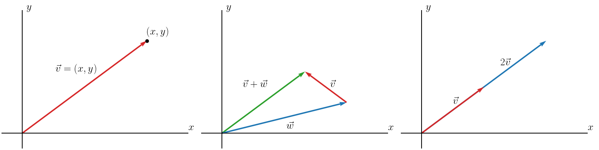

# Lab - Structs

## Remote Access

Often, you'll want to be able to connect to, and run programs on computers that you don't have a keyboard attached to. You _already_ do this when connecting to a network over the internet. The primary means that you use to connect to computers at the command line is a tool called "SSH". SSH allows you to authenticate (usually via your username and password) to a remote computer so you can access its command line.

The `scp` command allows you to copy files to and from your local computer with a remote one.

The remote computer that you all have access to is called "chuck.egr.msu.edu", and your authentication credentials are your MSU NetID, and EGR password (_not_ your CSE password). Note that, because this class has transitioned away from using DECS servers to Coding Rooms, you may be unable to access the Chuck server. Certain countries are firewalled as well, unfortunately.

[Read this tutorial from The New Stack](https://thenewstack.io/linux-lesson-copy-files-over-your-network-with-scp/).

⭐ Show your TA the hypothetical command you would run to copy a file, named 'test.png', on your laptop's Downloads folder to your CSE account's Desktop.

## Coding Assignment

We are going to work on making our own data structures using a C++ `struct`. More specifically, we are going to create some sample member functions for a two-dimensional, euclidean vector, represented as a `struct` named `MathVector`.

### Background

A vector can be thought of as an arrow that has some varying magnitude and direction. It is usually represented by an  pair (referred to as the _components_), where the starting point of the vector is assumed to be at , with the head of the vector meeting at coordinates .

<div align="center">
    
</div>

Below are some of the operations that can be performed on a vector, all of which you'll ultimately implement for your `MathVector` `struct`.

For the following examples, let:

<div align="center">

</div>

<div align="center">

</div>

#### Vector Addition

The addition of two vectors returns a new vector whose components are the sums of the operand vectors' components applied parallely.

<div align="center">

</div>

&nbsp;

#### Vector Multiplication

Vector multiplication can be done in _many_ ways depending on the second operand. We'll focus on, and implement two of these.

When a vector is multiplied by a scalar (i.e., any number), it becomes _scalar multiplication_, where the scalar is simply multiplied against every component of the vector to compose a new vector.

<div align="center">

</div>

&nbsp;

When two vectors are multiplied together, the components are multiplied parallely and summed to return a scalar value (_not_ a new vector). This is called the _dot product_ (there is also a _cross product_, but we won't be doing that for today).

<div align="center">

</div>

&nbsp;

#### Vector Magnitude

A vector's _magnitude_ (AKA its length) can be calculated using a simplified version of the euclidean distance formula. This, again, does not return a new vector -- it returns a scalar value.

<div align="center">

</div>

&nbsp;

### Program Specifications

[Download the starter code provided here](../assets/downloads/lab_structs.zip).

Your task is to create an implementation file (named "math_vector.cpp") that provides the algorithm for all of the member functions shown below (and inside the header file).

Note that some of the work has been done for you. Here is what has been completed so far:

`MathVector` has two data members:
- `int x`, represents the x component of the vector
- `int y`, represents the y component of the vector

The `MathVector` constructor has two declarations:
- A `default` constructor that initializes the data members, `x` and `y`, to 0.
- A two-parameter constructor that takes an input x and y component and assigns them to the `x` and `y` data members, respectively.

You are to _implement_ the following functions in your math_vector.cpp file:

&nbsp;

```c++
string vec_to_str(const MathVector &v)
```

Takes a `MathVector` instance and returns a `string` representation of the `MathVector` in the format "`x:y`".

_This is a free function, not a member function_.

&nbsp;

```c++
MathVector add(const MathVector &other)
```

Takes a second operand `MathVector` instance, `other`, and adds them to produce a new `MathVector` instance.

⭐ Show the TA your functioning `add()` method before moving on.

&nbsp;

```c++
MathVector mult(int a)
```

Multiplies the `MathVector` instance by a scalar, `a`. Returns the resultant `MathVector` instance.

&nbsp;

```c++
int mult(const MathVector &other)
```

Takes the dot product between the two `MathVector` instances. Returns the resultant `int`.

&nbsp;

```c++
double magnitude()
```

Takes the magnitude of the `MathVector` instance. Returns `double`.

⭐ Show the TA your completed `MathVector` class.

## Honors Material - Building a Custom Command-Line Parser

C++ objects should be designed to be intuitive to use.  They might do complex work inside of them, but the interface should look simple.  In this lab, we are going to build a C++ struct that will take care of processing command line arguments for us.

### Background

In multiple previous labs, we have written command-line applications where our main function began with:

```c++
int main(int argc, char * argv[]) { ... }
```

While this provides us with a way to access the command line arguments, it is not always intuitive to use.  In fact, this interface was first defined for the C language in the 1960's.  We can't change it directly, but what we can do is build our own arg manager on top of it to make command-line arguments easier to work with. Specifically, we would like our main functions to look like:

```c++
int main(int argc, char * argv[]) {
  ArgManager args(argc, argv);
  ...
}
```

Afterward we should be able to just use `args` for all of our needs, and it should have a more useful and intuitive interface.

### Assignment

Write the `ArgManager` struct.  It should have a constructor that takes in `argc` and `argv` as well as a series of other member functions.  These should include:

* `const std::string & GetExeName()` should return the name of the executable being run, which is normally found at `argv[0]`.

* `bool Has(const std::string & arg_name)` should return `true` if `arg_name` was one of the arguments passed in on the command line, false otherwise.  This function will often be used to determine if a flag is present.

* `std::vector<std::string> GetFlagArgs()` should return a vector of all of the arguments passed in that begin with a dash (i.e., the character '-'), in the original order.

* `std::vector<std::string> GetNonFlagArgs()` should return a vector of all of the arguments passed in that do not begin with a dash, in the original order.  Note that you should not include the executable name in the return vector.

If we name our ArgManager object `args`, we call our executable `echo_args` (you will see why below), and we run it with the line:
```bash
./echo_args -i abc def -L ghi
```

then:
* `args.GetExeName()` should return the string "./echo_args"
* `args.Has("-i")` should return true, while `args.Has("not_there")` should return false.
* `args.GetFlagArgs()` should return a vector of strings with two values in it, "-i" and "-L".
* `args.GetNonFlagArgs()` should return a vector of strings with three values in it, "abc", "def", and "ghi".

Now use this new struct to build a program that takes in arguments from the command line and prints back out all of the non-flag arguments, one per line.  By default, it should print the non-flag arguments in the same order that they appeared on the command line.

For example, we would expect:
```bash
./echo_args these are my args
```
to output
```
these
are
my
args
```

You should also implement two flags.  The `-s` flag should make your program sort the arguments before printing.  So,
```bash
./echo_args -s these are my args
```
would give us
```
are
args
my
these
```

Next, the `-l` flag should make your program print the length of each arg after it.  So,
```bash
./echo_args -l these are my args
```
would give us
```
these 5
are 3
my 2
args 4
```

The flags are allowed to come anywhere in the argument list and can be combined, so
```
./echo_args here are another -l set of possible -s arguments
```
would give us
```
another 7
are 3
arguments 9
here 4
of 2
possible 8
set 3
```

Note that this output is both sorted and annotated with length since both flags were present.

Your program should silently ignore any other flags that it doesn't know how to deal with.

### Trivia

In the first part of this lab you built a two-value MathVector struct along with a series of member functions that you can use for mathematical operations.  As it turns out, C++ gives you the ability to override the built-in mathematical operators when you build a new class.  So if you had MathVectors `vec1` and `vec2`, rather than running `vec1.add(vec2)` you could be able to simply write the much more intuitive `vec1 + vec2`.

Mathematical operations are overloaded simply by creating a member function with a special name.  For example, if you wanted to overload the operators for the functions you have already written in MathVector class, you could add to the class definition:

```c++
MathVector operator+(const MathVector & other) { return add(other); }
int operator*(const MathVector & other) { return mult(other); }
MathVector operator*(int other) { return mult(other); }
```
In fact, you can even set up an automatic conversion to strings.

```c++
operator std::string() { return vec_to_str(*this); }
```

Now you would be able to pass a MathVector into any function that required an `std::string` as its parameter and the MathVector would be automatically converted.  Note, in regards to this implementation, that you can always use the keyword `this` in a member function to get a pointer to the object that the function is being run on.  Dereferencing that points (i.e., `*this`) will give you the object itself.
