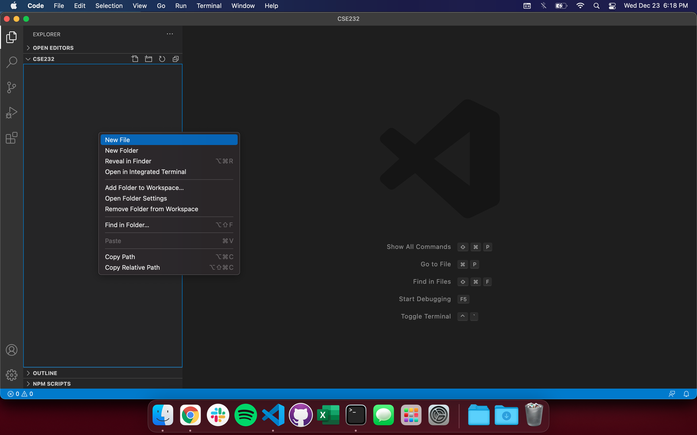
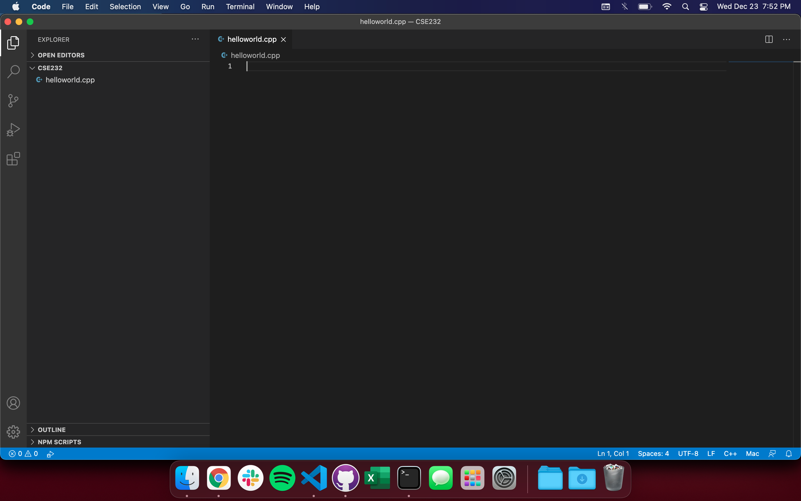
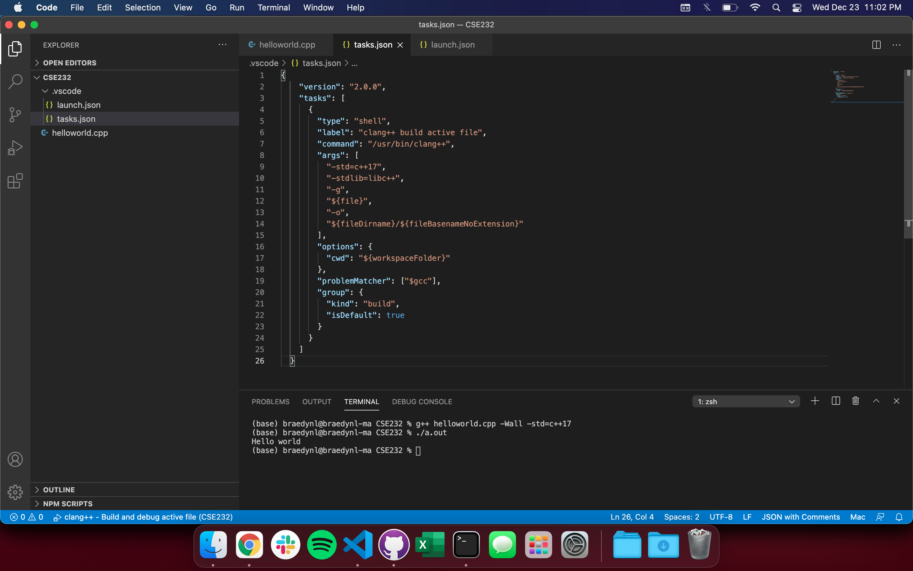
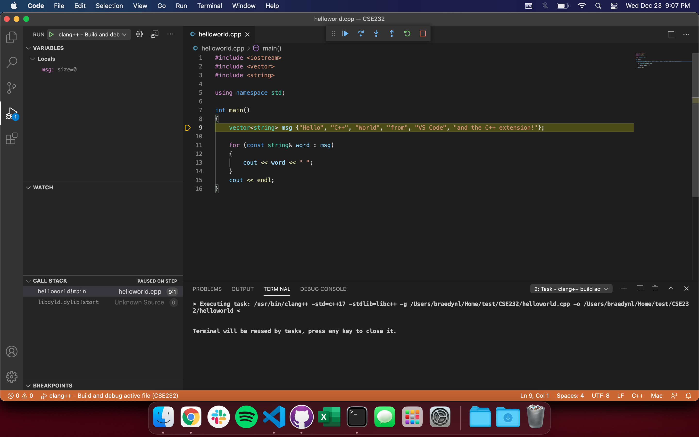
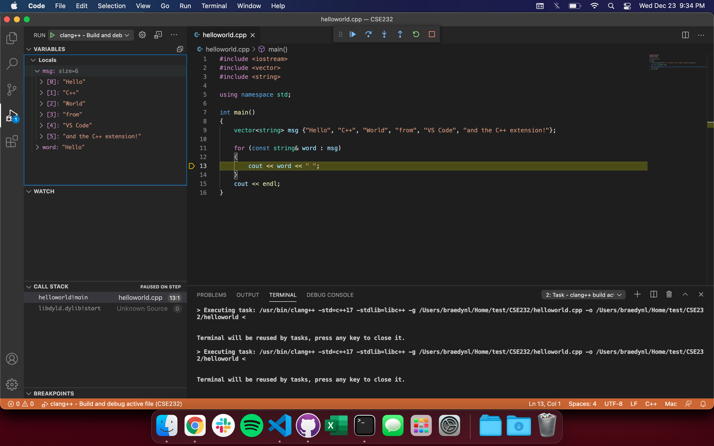

# Using C++ in VSCode - MacOS

The following tutorial assumes you are running on MacOS version 10.13 (High Sierra) or later, _but_ it's possible that this tutorial may still work on older versions -- we simply have no way of testing. You can check your MacOS version by clicking the Apple logo at the top-left, and selecting "About This Mac".

If you encounter any trouble during this tutorial, please ask about your problem on Piazza, or come to Help Room.

## Getting a Compiler

MacOS is based on a Unix operating system, meaning that you should already have a C/C++ compiler installed, namely [Clang](https://en.wikipedia.org/wiki/Clang).

To test that you have Clang installed, open Terminal and type the following command:

```bash
clang --version
```

You should see some output along the lines of:

```
Apple clang version 11.0.3 (clang-1103.0.32.59)
Target: x86_64-apple-darwin20.2.0
Thread model: posix
InstalledDir: /Library/Developer/CommandLineTools/usr/bin
```

If the return came back as something akin to:

```
zsh: command not found: clang
```

...type the following command, and test the first command to see if it works after running to continue with this tutorial:

```bash
xcode-select --install
```

You may be prompted a few times. In which case, accept/install any requests by the operating system.

In most of our lectures and labs, we'll be referring to a different compiler, [GCC](https://en.wikipedia.org/wiki/GNU_Compiler_Collection), because a majority of students run Windows, and thus will have to install GCC as opposed to Clang.

Despite this difference in compiler, you'll still be able to follow along with the course smoothly. In fact, MacOS assigns an alias (an alternate name) to the `clang` command you just used with what GCC users will be typing, `g++`. You can type this command into Terminal:

```bash
g++ --version
```

...and still see the Clang version be displayed. You probably won't use the `clang` command again from this point onwards.

## Preparing VSCode for C++

1. [Download and install the Stable version of Visual Studio Code (VSCode) here.](https://code.visualstudio.com/)

2. We recommend creating a folder somewhere on your computer dedicated to CSE232 content. Place this folder wherever you please.

3. Open VSCode, and you should be presented with a Welcome page. Near the top-left of the window, you should see an icon of files stacked onto one another. Click on this icon to open the integrated file explorer as shown here:


<div align="center">
    <p>*Your welcome page may look slightly different</p>
</div>

4. Click the "Open Folder" button, and navigate the explorer to the CSE232 folder you created in step 2.

5. The top of the sidebar should now display the name of the folder you opened, which is presumably empty (unless you have files there). You can right-click inside the folder for many of the options you'd typically have in Finder:



6. Create a file named "helloworld.cpp". ".cpp" is the file extension used to denote a C++ file. Make sure that all of your files have this extension when you're coding in C++ for this class. You should now have something like this:



7. After creating helloworld.cpp, you may have been prompted to install some sort of C++ "extension". Install the extension that's prompted if it appears. If you did not get prompted, navigate to the left-most sidebar, and click the icon represented by four squares. It should open-up some sort of "Extensions Marketplace" with a search bar at the top. Search "C++", and the top result should be an extension named "C/C++" made by Microsoft. Click this extension when you find it, and your resulting interface should look like this:


<div align="center">
    <p>*I have the extension already installed in this screenshot, which is why I have an "Uninstall" button near the top.</p>
</div>

8. Click the "Install" button near the name of the extension. If, after installing, it says "Reload Required", click the button that says so.

9. Go back to your helloworld.cpp file/integrated file explorer from the left-most sidebar (the top icon; the files stacked onto one another, remember) and type/copy-paste the following code into your helloworld.cpp file:

```c++
#include <iostream>

int main() {
    std::cout << "Hello world" << std::endl;
}
```

10. On your keyboard, use the key-combination: CONTROL + \` (this is the backtick character, if you're unfamiliar. It should be to the left of the "1" key on most keyboards). This brings up VSCode's integrated terminal:


<div align="center">
    <p>*You can also open the integrated terminal by dragging from the top of the blue bar at the bottom of the window.</p>
</div>

11. The terminal is where you compile your C++ source code. Most labs will have short sections dedicated to learning more about the terminal, as you'll need to be comfortable with it for future classes. To compile our helloworld.cpp program, type the following command into the terminal:

```bash
g++ helloworld.cpp -Wall -std=c++17
```

12. This produces a file named "a.out" -- you should see it appear in the file explorer. To run your compiled program, type into the terminal:

```bash
./a.out
```

13. You should now see "Hello world" displayed to the console!


<div align="center">
<p>Congratulations! You just made your first program in C++.</p>
</div>

It's important to note that **you must compile your program and run a.out every time you want to test your code**. It's a bit annoying compared to, say, running Python code. But, such is the nature of low-level languages.

You will be typing those two commands hundreds, if not _thousands_ of times in this course. Keep them in your notes, or memorize them (you'll likely have them memorized within a few days of practice).

## Debugging C++ in VSCode

You should be familiar with an IDE debugger from your previous programming class (CSE231 or an equivalent prerequisite). [If you aren't, please read through this tutorial](../DEBUGGING_GUIDE.md) (it's in Python, but the same core principles apply).

1. In the CSE232 folder, create a subfolder named ".vscode", and create two files within it: "tasks.json", and "launch.json", as shown in the file explorer on the left-side here:


<div align="center">
  <p>*The dot prefix in ".vscode" makes it a hidden folder. Meaning that, you probably won't be able to see it in Finder unless you input COMMAND + SHIFT + . on your keyboard.</p>
</div>

2. Copy-and-paste the following code into your tasks.json file, and save it (COMMAND + S):

```json
{
  "version": "2.0.0",
  "tasks": [
    {
      "type": "shell",
      "label": "clang++ build active file",
      "command": "/usr/bin/clang++",
      "args": [
        "-std=c++17",
        "-stdlib=libc++",
        "-g",
        "${file}",
        "-o",
        "${fileDirname}/${fileBasenameNoExtension}"
      ],
      "options": {
        "cwd": "${workspaceFolder}"
      },
      "problemMatcher": ["$gcc"],
      "group": {
        "kind": "build",
        "isDefault": true
      }
    }
  ]
}
```



3. Copy-and-paste the following code into your launch.json file and save it (COMMAND + S):

```json
{
  "version": "0.2.0",
  "configurations": [
    {
      "name": "clang++ - Build and debug active file",
      "type": "cppdbg",
      "request": "launch",
      "program": "${fileDirname}/${fileBasenameNoExtension}",
      "args": [],
      "stopAtEntry": true,
      "cwd": "${workspaceFolder}",
      "environment": [],
      "externalConsole": false,
      "MIMode": "lldb",
      "preLaunchTask": "clang++ build active file"
    }
  ]
}
```


4. Open and replace the contents of helloworld.cpp for this more complex version:

```c++
#include <iostream>
#include <vector>
#include <string>

using namespace std;

int main()
{
    vector<string> msg {"Hello", "C++", "World", "from", "VS Code", "and the C++ extension!"};

    for (const string& word : msg)
    {
        cout << word << " ";
    }
    cout << endl;
}
```

5. You should see an icon on the left sidebar that looks like a play button with a bug on it -- this is the debugger menu, go ahead and open it. Like most IDE debuggers, it has a menu showing your currently active variables, watched variables, call stack, and currently active breakpoints.


6. Run the file with the debugger by hitting the green play button at the top-left, or by hitting F5 on your keyboard (you may need to use a key-combination; FN + F5). VSCode will automatically set a breakpoint at the beginning of your `main()` function. If you set your own breakpoint (by clicking slightly to the left of a line number), the automatically placed breakpoint will be skipped.



Your terminal should populate with commands that were automatically executed by the .json files I had you create. If your VSCode interface looks like mine in the screenshot above, then everything is working properly. Congrats!

The yellow-highlighted line shows the next line to be ran, as you could probably imagine.

At the top is the Debugger Control Panel:

<div align="center">
    
</div>

It includes your standard debugging options. In order from left to right:
1. **Continue** - Runs the program up until the next breakpoint.
2. **Step Over** - Runs a line without stepping into a function call.
3. **Step Into** - Runs a line and steps into a function call.
4. **Step Out** - Steps out of a function call.
5. **Restart** - Re-executes the program with the debugger active.
6. **Stop** - Exits the debugger.

The rectangle of dots on the left-side of the panel is a drag-point, where you can click and hold to drag the panel elsewhere in the window.

After defining the `msg` variable by stepping through, you can click its dropdown inside the debugger menu to see its contents denoted by index.



The `vector` type is C++'s version of arrays/lists. You'll learn more about them during Week 06 😉

If you've done everything here without a hitch, head on back to [Lab 00](../labs/lab00.html) for the rest of the CSE232 setup. You're almost done!
