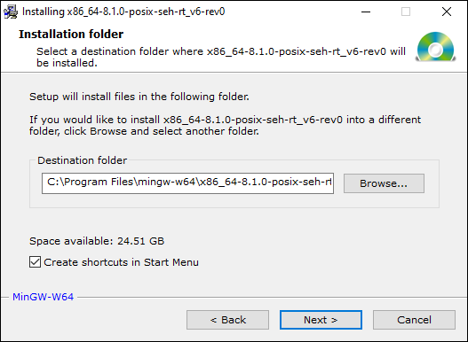
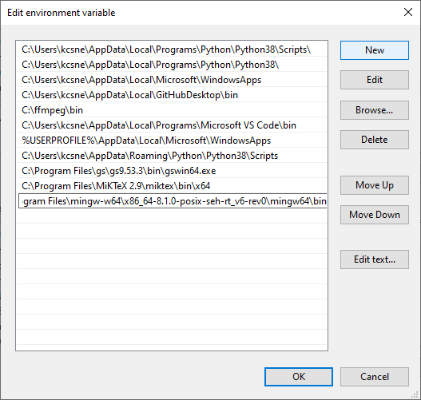
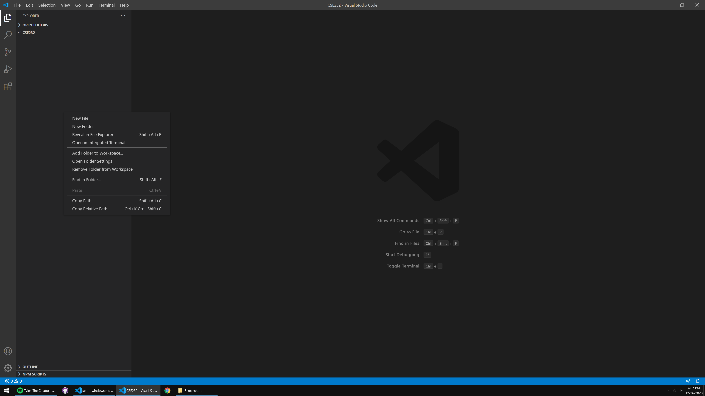
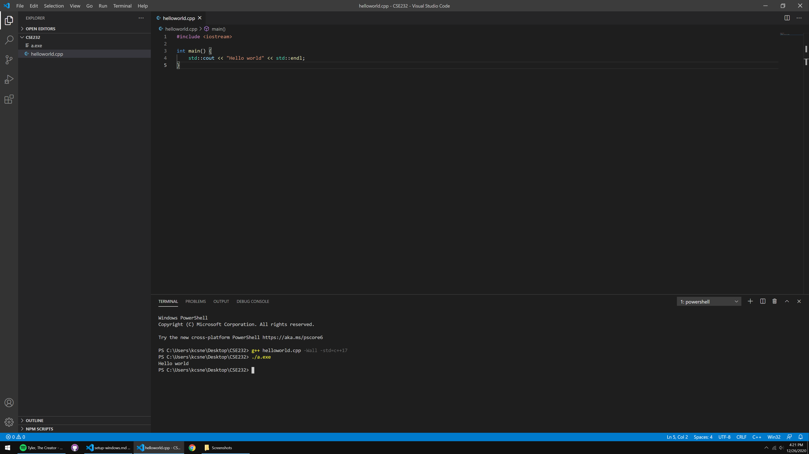
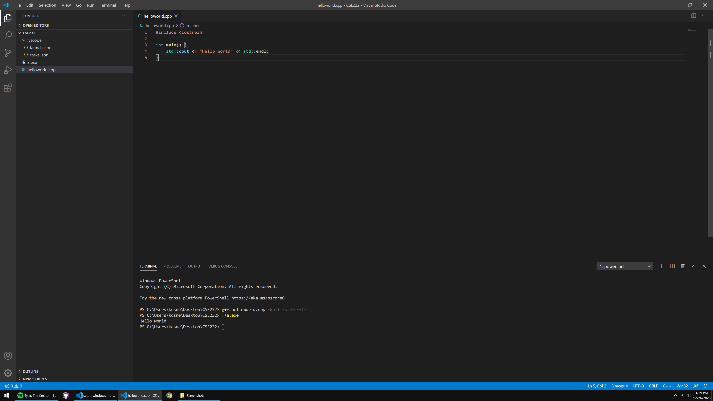
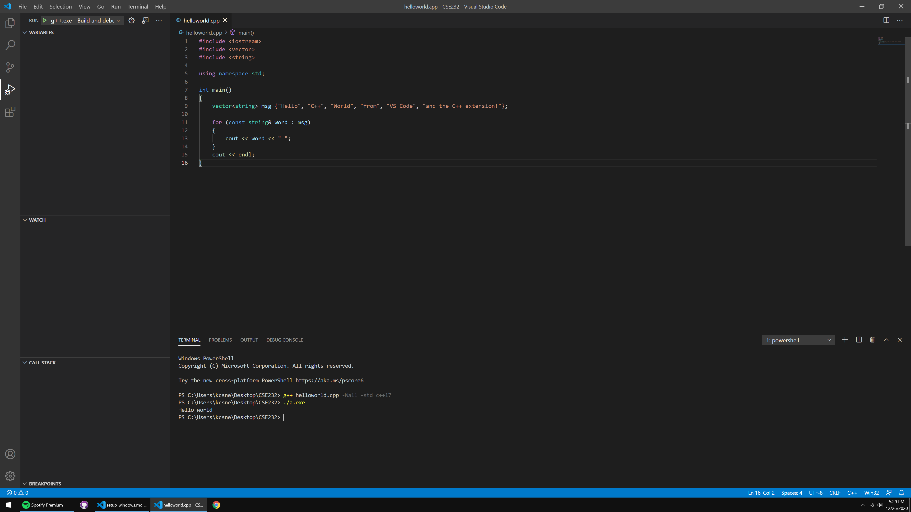
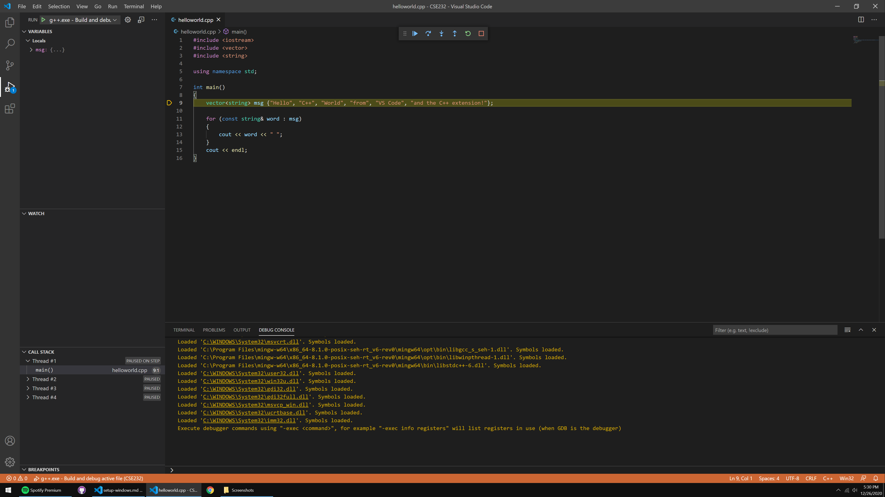

# Using C++ in VSCode - Windows

The following tutorial assumes you are running on Windows 10.

If you encounter any trouble during this tutorial, please ask about your problem on Piazza, or come to Help Room.

## Getting a Compiler

Despite many of the Windows applications being written in C, Microsoft does not package a C/C++ compiler with the operating system. So, we unfortunately have to install one ourselves.

We recommend that you install MinGW (Minimalist GNU for Windows), a software package that includes the compiler we'll be using, GCC.

1. [Download the MinGW installer here (the download should begin automatically).](https://sourceforge.net/projects/mingw-w64/files/Toolchains%20targetting%20Win32/Personal%20Builds/mingw-builds/installer/mingw-w64-install.exe/download)

2. Open the installer, and click next at the first screen.

<div align="center">

</div>

{:start="3"}
3. On the Settings screen, select "x86_64" under the Architecture dropdown menu. __Do not change any of the other settings.__

<div align="center">

</div>

{:start="4"}
4. On the Installation Folder screen, __do not change the destination folder that is set by default__. You can disable the "Create shortcuts in Start Menu" option if you wish, and simply click Next to begin the installation.

<div align="center">

</div>

{:start="5"}
5. Wait for the installation to finish before closing the window.

6. Type into your Windows search bar: "Edit the system environment variables". You should see an application of the same name appear in the results. Open it once it appears.


{:start="7"}
7. A window named "System Properties" should appear. Select the "Environment Variables" button at the bottom.

<div align="center">

</div>

{:start="8"}
8. On the Environment Variables window, select the "Path" Variable under "User variables for X", and click the "Edit..." button below it.

<div align="center">

</div>

{:start="9"}
9. Click the "New" button near the top-right of the window to add an environment variable. Copy-and-paste the following path into the newly-opened entry, and hit ENTER/RETURN to finish it.  

```
C:\Program Files\mingw-w64\x86_64-8.1.0-posix-seh-rt_v6-rev0\mingw64\bin
```

<div align="center">

</div>

{:start="10"}
10. __Click "OK" to exit every window we've opened thus far.__

11. Verify that the compiler is now installed by opening a Command Prompt (you can go to your Windows search bar again, and type "cmd"), and typing the command, `g++ --version`, at the prompt. You should see a message alike the one in this screenshot:

<div align="center">

</div>

<div align="center">
    <p>Congrats! You now have a C/C++ compiler installed. But, we're not done yet...</p>
</div>

Now we have to install VSCode and get it to cooperate with the compiler we just installed. Pat yourself on the back for making it this far.

## Preparing VSCode for C++

1. [Download and install the Stable version of Visual Studio Code (VSCode) here.](https://code.visualstudio.com/)

2. We recommend creating a folder somewhere on your computer dedicated to CSE232 content. Place this folder wherever you please.

3. Open VSCode, and you should be presented with a Welcome page. Near the top-left of the window, you should see an icon of files stacked onto one another. Click on this icon to open the integrated file explorer as shown here:


<div align="center">
    <p>*Your welcome page may look slightly different</p>
</div>

{:start="4"}
4. Click the "Open Folder" button, and navigate the explorer to the CSE232 folder you created in step 2.

5. The top of the sidebar should now display the name of the folder you opened, which is presumably empty (unless you have files there). You can right-click inside the folder for many of the options you'd typically have in File Explorer:



{:start="6"}
6. Create a file named "helloworld.cpp". ".cpp" is the file extension used to denote a C++ file. Make sure that all of your files have this extension when you're coding in C++ for this class. You should now have something like this:


{:start="7"}
7. After creating helloworld.cpp, you may have been prompted to install some sort of C++ "extension". Install the extension that's prompted if it appears. If you did not get prompted, navigate to the left-most sidebar, and click the icon represented by four squares. It should open-up some sort of "Extensions Marketplace" with a search bar at the top. Search "C++", and the top result should be an extension named "C/C++" made by Microsoft. Click this extension when you find it, and your resulting interface should look like this:


<div align="center">
    <p>*I have the extension already installed in this screenshot, which is why I have an "Uninstall" button near the top.</p>
</div>

{:start="8"}
8. Click the "Install" button near the name of the extension. If, after installing, it says "Reload Required", click the button that says so.

9. Go back to your helloworld.cpp file/integrated file explorer from the left-most sidebar (the top icon; the files stacked onto one another, remember) and type/copy-paste the following code into your helloworld.cpp file:

```c++
#include <iostream>

int main() {
    std::cout << "Hello world" << std::endl;
}
```

{:start="10"}
10. On your keyboard, use the key-combination: CONTROL + \` (this is the backtick character, if you're unfamiliar. It should be to the left of the "1" key on most keyboards). This brings up VSCode's integrated terminal:


<div align="center">
    <p>*You can also open the integrated terminal by dragging from the top of the blue bar at the bottom of the window.</p>
</div>

**Optional Step**: VSCode will probably set your default shell as Windows Powershell when you first begin using it. If you're comfortable with Windows Powershell, feel free to keep it as is. If you want to switch your shell to CMD (command prompt), you can select from the "Select Default Shell" option in the dropdown near the top-right of the terminal window:

<div align="center">
  
</div>

A second menu will appear at the top. Select "CMD" from that menu, then close and reopen VSCode to see your terminal open in command prompt. 

{:start="11"}
11. The terminal is where you compile your C++ source code. Most labs will have short sections dedicated to learning more about the terminal, as you'll need to be comfortable with it for future classes. To compile our helloworld.cpp program, type the following command into the terminal:

```bash
g++ helloworld.cpp -Wall -std=c++17
```

{:start="12"}
12. This produces a file named "a.exe" -- you should see it appear in the file explorer. To run your compiled program, type into the terminal:

```bash
./a.exe
```

(If you're using command prompt as your shell, you can simply type `a.exe`, or even just `a` as an alternative)

{:start="13"}
13. You should now see "Hello world" displayed to the console!



<div align="center">
<p>Congratulations! You just made your first program in C++.</p>
</div>

During most lectures and labs, you'll commonly hear us, instructors, refer to the output executable as "a.out". This is the default name given to the executable on Unix-based systems. Since you're on Windows, it'll be renamed to "a.exe", which you can simply think of as your version of "a.out".

It's important to note that **you must compile your program and run a.exe every time you want to test your code**. It's a bit annoying compared to, say, running Python code. But, such is the nature of low-level languages.

You will be typing those two commands hundreds, if not _thousands_ of times in this course. Keep them in your notes, or memorize them (you'll likely have them memorized within a few days of practice).

## Debugging C++ in VSCode

You should be familiar with an IDE debugger from your previous programming class (CSE231 or an equivalent prerequisite). [If you aren't, please read through this tutorial](../debugging_guide.html) (it's in Python, but the same core principles apply).

1. In the CSE232 folder, create a subfolder named ".vscode", and create two files within it: "tasks.json", and "launch.json", as shown in the file explorer on the left-side here:



{:start="2"}
2. Copy-and-paste the following code into your tasks.json file, and save it (CTRL + S):

```json
{
    "version": "2.0.0",
    "tasks": [
      {
        "type": "shell",
        "label": "C/C++: g++.exe build active file",
        "command": "C:\\Program Files\\mingw-w64\\x86_64-8.1.0-posix-seh-rt_v6-rev0\\mingw64\\bin\\g++.exe",
        "args": ["-g", "${file}", "-o", "${fileDirname}\\${fileBasenameNoExtension}.exe"],
        "options": {
          "cwd": "${workspaceFolder}"
        },
        "problemMatcher": ["$gcc"],
        "group": {
          "kind": "build",
          "isDefault": true
        },
      }
    ]
  }
```


{:start="3"}
3. Copy-and-paste the following code into your launch.json file and save it (CTRL + S):

```json
{
    "version": "0.2.0",
    "configurations": [
      {
        "name": "g++.exe - Build and debug active file",
        "type": "cppdbg",
        "request": "launch",
        "program": "${fileDirname}\\${fileBasenameNoExtension}.exe",
        "args": [],
        "stopAtEntry": true,
        "cwd": "${workspaceFolder}",
        "environment": [],
        "externalConsole": false,
        "MIMode": "gdb",
        "miDebuggerPath": "C:\\Program Files\\mingw-w64\\x86_64-8.1.0-posix-seh-rt_v6-rev0\\mingw64\\bin\\gdb.exe",
        "setupCommands": [
          {
            "description": "Enable pretty-printing for gdb",
            "text": "-enable-pretty-printing",
            "ignoreFailures": true
          }
        ],
        "preLaunchTask": "C/C++: g++.exe build active file",
      },
    ]
  }
```


{:start="4"}
4. Open and replace the contents of helloworld.cpp for this more complex version:

```c++
#include <iostream>
#include <vector>
#include <string>

using namespace std;

int main()
{
    vector<string> msg {"Hello", "C++", "World", "from", "VS Code", "and the C++ extension!"};

    for (const string& word : msg)
    {
        cout << word << " ";
    }
    cout << endl;
}
```

{:start="5"}
5. You should see an icon on the left sidebar that looks like a play button with a bug on it -- this is the debugger menu, go ahead and open it. Like most IDE debuggers, it has a menu showing your currently active variables, watched variables, call stack, and currently active breakpoints.



{:start="6"}
6. Run the file with the debugger by hitting the green play button at the top-left, or by hitting F5 on your keyboard (you may need to use a key-combination; FN + F5). VSCode will automatically set a breakpoint at the beginning of your `main()` function.



<div align="center">
  <p>*You can disable the automatic breakpoint by setting the <code>"stopAtEntry"</code> value in launch.json to <code>false</code>.</p>
</div>

Your terminal should populate with commands that were automatically executed by the .json files I had you create. If your VSCode interface looks like mine in the screenshot above, then everything is working properly. Congrats!

The yellow-highlighted line shows the next line to be ran, as you could probably imagine.

At the top is the Debugger Control Panel:

<div align="center">
    
</div>

It includes your standard debugging options. In order from left to right:
1. **Continue** - Runs the program up until the next breakpoint.
2. **Step Over** - Runs a line without stepping into a function call.
3. **Step Into** - Runs a line and steps into a function call.
4. **Step Out** - Steps out of a function call.
5. **Restart** - Re-executes the program with the debugger active.
6. **Stop** - Exits the debugger.

The rectangle of dots on the left-side of the panel is a drag-point, where you can click and hold to drag the panel elsewhere in the window.

**Important**: use **Step Over** to execute lines that are not invoking functions you built yourself, and use **Step Into** when a line *is* invoking a function you built yourself. If you step into lines that are running code from the Standard Template Library (STL), you'll be going through *a lot* of code that is unnecessary for you to see.

After defining the `msg` variable by stepping through (with **Step Over**), you can click its dropdown inside the debugger menu to see its contents denoted by index (again, use **Step Over** when a line isn't invoking one of *your own* functions):


The `vector` type is C++'s version of arrays/lists. You'll learn more about them during Week 06 😉

If you've done everything here without a hitch, head on back to [Lab 01](../labs/lab01.html) for the rest of the CSE232 setup. You're almost done!
