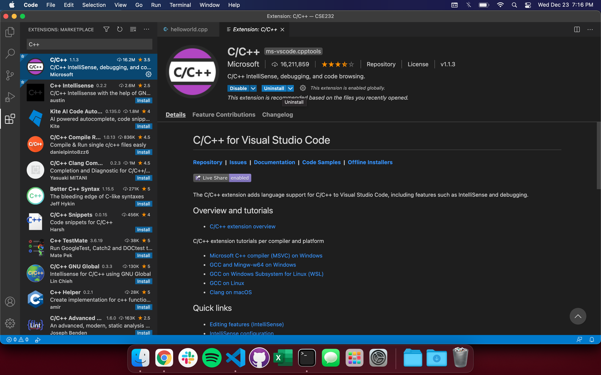
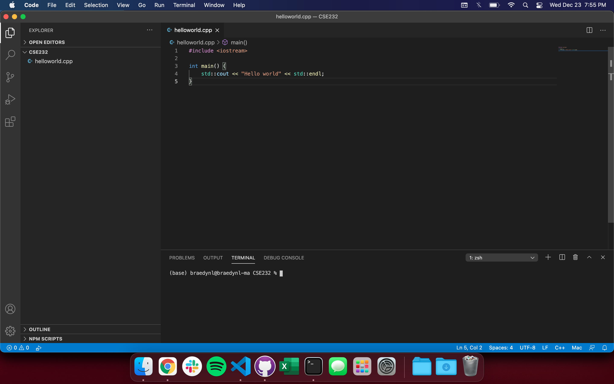
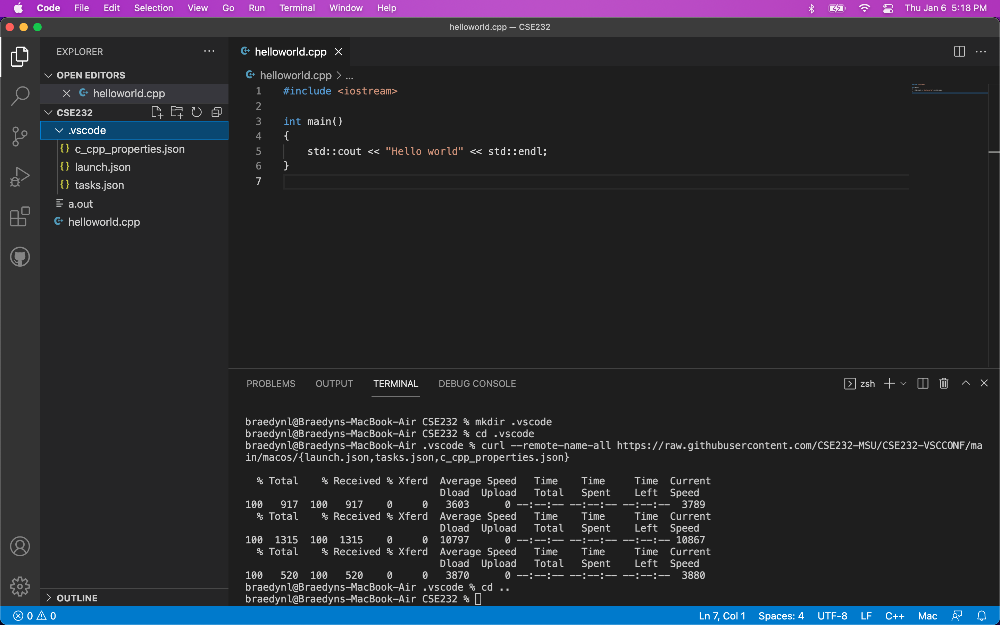
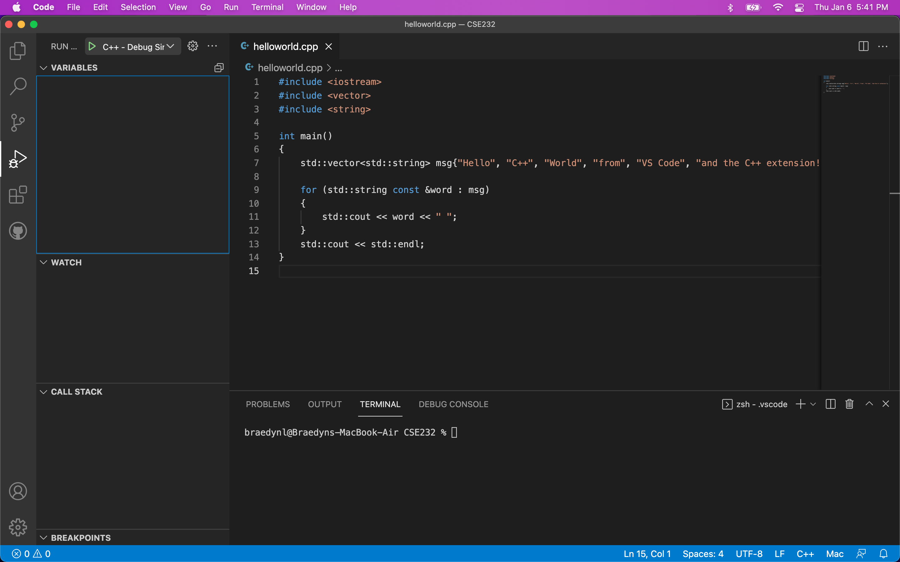
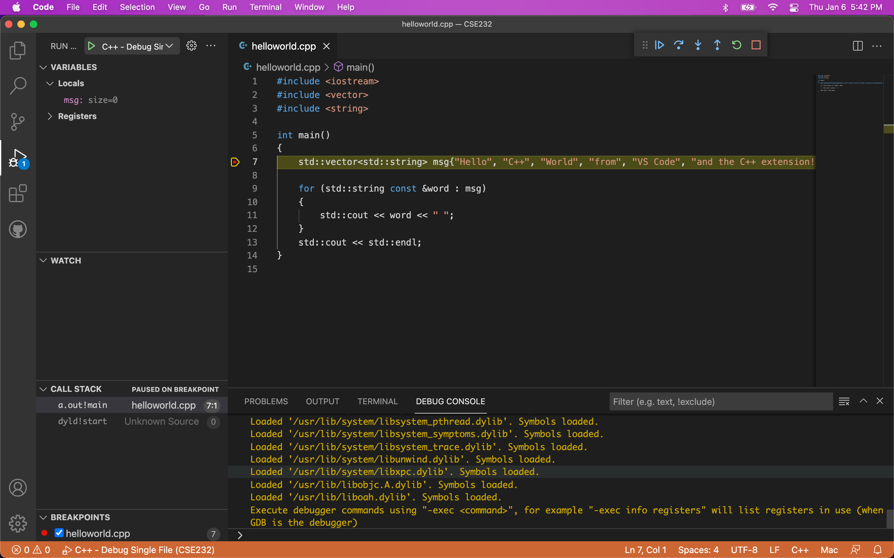
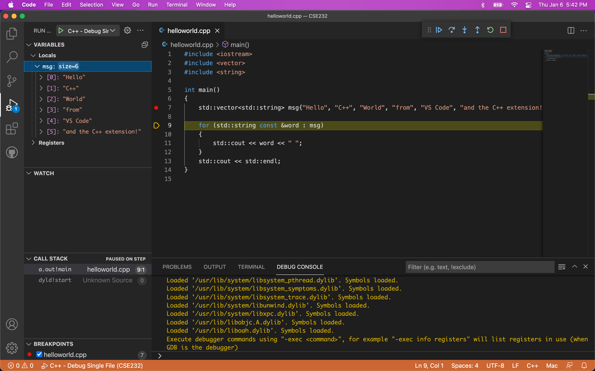

# Using C++ in VSCode - MacOS

Congratulations on having a Mac! You guys most definitely have the easiest setup of the three (really, two) operating systems we provide tutorials for.

Why do you guys have it so easy? Well, MacOS is based on the [Unix OS family](https://en.wikipedia.org/wiki/Unix), and so you already have full access to Linux command-line tools - Windows users do not have this luxury. Much of the Windows tutorial is spent just getting the Windows operating system setup with a "psuedo Linux environment", called [Windows Subsystem for Linux](https://docs.microsoft.com/en-us/windows/wsl/about). You guys have everything we need packed into a single terminal command, provided by the Apple developers.

## Requirements

The following tutorial assumes you are running on MacOS version 10.13 (High Sierra) or later, _but_ it's possible that this tutorial may still work on older versions - we simply have no way of testing. You can check your MacOS version by clicking the Apple logo at the top-left, and selecting "About This Mac".

I recommend taking the time to update your system now if you are below version 10.13.

## Getting a Compiler

The easiest way to get a C++ compiler is to use Apple's provided Xcode tools, which comes packaged with a compiler called "Clang". You may already have this installed, if you had been working with terminal features before this class.

To test that you have Clang installed, open Terminal and use the following command:

```bash
clang --version
```

If the return came back as something akin to:

```
zsh: command not found: clang
```

then use the following command to install the Xcode command-line tools (approve any requests it may make, the full installation can take a while):

```bash
xcode-select --install
```

Otherwise, if you saw a message alike:

```
Apple clang version 11.0.3 (clang-1103.0.32.59)
Target: x86_64-apple-darwin20.2.0
Thread model: posix
InstalledDir: /Library/Developer/CommandLineTools/usr/bin
```

Then you're all set!

After installation, I recommend running the `clang --version` command again to see if you get the above output.

In most of our lectures and labs, we'll be referring to a different compiler, `g++`, since `g++` is by far the most popular C++ compiler. MacOS assigns the name `g++` as an alias to `clang++` after installing the Xcode command-line tools, which you can see by using: 

```bash
g++ --version
```

You probably won't use the `clang` or `clang++` command again from this point onwards.

## Preparing VSCode for C++

[Download and install the Stable version of Visual Studio Code here.](https://code.visualstudio.com/)

I recommend using an existing folder, or creating a new folder dedicated to CSE 232 content. This folder can be anywhere.

Open VSCode, and you should be presented with a welcome page. Near the top-left of the window, you should see an icon of files stacked onto one another. Click on this icon to open the integrated file explorer as shown here:


Click the "Open Folder" button, and navigate the explorer to the CSE 232 folder you created earlier.

The top of the sidebar should now display the name of the folder you opened, which is presumably empty (unless you have files there). You can right-click inside the panel for many of the options you'd typically have in Finder:


Click the icon of four squares on the left sidebar to bring up the Extensions Marketplace. Search for "C/C++" and you should find an extension of the same name, developed by Microsoft:



Go ahead and **Install** the extension once you find it.

Go back to the integrated file explorer after installing the extension and create a file named "helloworld.cpp". Type/copy-paste the following code into your helloworld.cpp file:

```c++
#include <iostream>

int main()
{
    std::cout << "Hello world" << std::endl;
}
```

On your keyboard, use the key-combination: CMD + \` (this is the backtick character, it should be to the left of the 1 key on most keyboards). This toggles VSCode's integrated terminal:



The terminal is where you compile your C++ source code. Most labs will have short sections dedicated to learning more about the terminal, as you'll need to be comfortable with it for general navigation and future coursework. Save your helloworld.cpp file if you haven't already (CMD + S), and in order to compile our lovely program, type the following command into the terminal:

```bash
g++ helloworld.cpp -Wall -std=c++17
```

This produces a file named "a.out" – you should see it appear in the file explorer. To run your compiled program, type into the terminal:

```bash
./a.out
```

And you should then see "Hello world" displayed to the console!


<div align="center">
<p>Congratulations! You just made your first program in C++.</p>
</div>

It's important to note that **you must compile your program and run a.out every time you want to test your code**. You will be typing those two commands hundreds of times in this course. Keep them in your notes or memorize them (you'll likely have them memorized within a few days of practice).

If you setup the debugger (the section below), you can compile and run in a single mouse-click. We'll be talking more about the compilation command and what you can do with it, though, so it's best to be familiar with both.

**Note**: I _strongly_ recommend you setup the debugger now, and use it to your advantage throughout this course. It is incredibly helpful once you get the hang of it.

## Debugging C++ in VSCode

You should be familiar with an IDE debugger from your previous programming class (CSE 231 or an equivalent prerequisite). [If you aren't, please read through this tutorial](../debugging_guide.html) (it's in Python, but the same core principles apply).

Go back to the Extensions Marketplace to find and install the "CodeLLDB" extension made by Vadim Chugunov. It should be the only extension that appears.

In order to debug C++ code, we need to give VSCode some extra information about _how_ we want to debug. We provide some debugging configurations for you that can be installed through terminal.

Execute the following commands one-by-one to install our recommended configuration files:

```bash
mkdir .vscode
cd .vscode
curl --remote-name-all https://raw.githubusercontent.com/CSE232-MSU/CSE232-VSCCONF/main/macos/{launch.json,tasks.json,c_cpp_properties.json}
cd ..
```



You should now have a folder named ".vscode" containing three .json files, if expanded in the explorer panel.

The .vscode folder is a special folder that VSCode will search for when performing certain tasks. The .vscode folder you just created by doing this process **is unique to the directory you're currently in, which is your CSE 232 folder at the moment**. Moving VSCode to a new directory means that you will no longer have the same configurations. [You can reference the process we just ran through to install these configuration files here](https://github.com/CSE232-MSU/CSE232-VSCCONF), if you want to move your workspace to a different folder (this is also on the Setup home page). You can also just copy this .vscode folder around with you, if you move your workspace elsewhere.

Replace the contents of the helloworld.cpp file for this more complex version:

```c++
#include <iostream>
#include <vector>
#include <string>

int main()
{
    std::vector<std::string> msg{"Hello", "C++", "World", "from", "VS Code", "and the C++ extension!"};

    for (std::string const &word : msg)
    {
        std::cout << word << " ";
    }
    std::cout << std::endl;
}
```

You should see an icon on the left sidebar that looks like a play button with a bug on it – this is the debugger menu, go ahead and open it. Like most IDE debuggers, it has a menu showing your currently active variables, watched variables, call stack, and currently active breakpoints.



Set a breakpoint on the first line of the `main()` function by clicking slightly to the left of its line number; you should see a red dot appear. Then, execute the debugger by hitting the green play button at the top-left.



Your terminal should populate with commands that were automatically executed by the .vscode configuration I had you install. If your VSCode interface looks like mine in the screenshot above, then everything is working properly. Congrats!

The yellow-highlighted line shows the next line to be ran, as you could probably imagine.

At the top is the Debugger Control Panel:

<div align="center">

</div>

It includes your standard debugging options. In order from left to right:
- **Continue** - Run the program until next breakpoint
- **Step Over** - Run the highlighted line without stepping into the function call (if present)
- **Step Into** - Run the highlighted line and step into the function call (if present)
- **Step Out** - Step out of a function call (if inside a function body)
- **Restart** - Re-execute the program with the debugger active
- **Stop** - Exit the debugger

The rectangle of dots on the left-side of the panel is a drag-point, where you can click and hold to drag the panel elsewhere in the window.

After defining the `msg` variable by stepping, you can click its dropdown inside the debugger menu to see its contents denoted by index.



The `std::vector` and `std::string` classes are things you'll learn at a later date.

Your debugger is now ready-to-go! Included with the .vscode folder are two debugging configurations: single file, and multi file. You can choose the configuration by hitting the dropdown menu next to the green play button. You won't need to worry about multi-file compilation for a few weeks, yet.

Included with the configuration we gave you is also a c_cpp_properties.json file, that Windows users will not have by default. For whatever reason, VSCode will use an outdated version of C++ to lint your code (that is, attempt to detect problems before compilation) on MacOS systems. The provided c_cpp_properties.json file will force the linter to use C++ 17.
