# Using C++ in VSCode - Windows

In this tutorial, we'll be installing Microsoft's Windows Subsystem for Linux (WSL). This is a somewhat complex thing to get installed, and so it's imperative that you read through these instructions carefully.

To begin, we'll first talk about what WSL is, and why we recommend it. I'll talk about an alternative as well, but the alternative should only be used if you, for whatever reason, cannot get WSL installed properly, or something goes wrong with your WSL installation at some point during the semester.

### What is WSL?

The Windows Subsystem for Linux creates a fully-functional Linux filesystem directly onto your Windows machine. It gives you complete access to Linux command-line tools, which you'll be learning about in this class' labs. Please note that WSL is only available on Windows 10 or later (the specific build is explained later).

### Why WSL?

Windows does not come equipped with Linux command-line tools. It provides two shells: Command Prompt and Windows Powershell, both of which do not provide the same set of tools as those that you'd have on a Unix-like system (Windows Powershell has some of them, but not all that we'll be talking about in this course).

It's possible to compile and run C++ programs without a Unix-like system through software like [MinGW-w64](https://www.mingw-w64.org/), but you will ultimately need a Unix shell to access the other commands that we'll be learning about.

### What if I can't install WSL?

There is a browser-based IDE called [Replit](https://replit.com/~) that I recommend if you cannot get WSL working on your machine. The reason we don't recommend using it for the course outright is due to speed; we'll be creating larger and larger programs as the semester goes on, and eventually you'll notice how slow Replit gets as the size of your programs increases. WSL is not bound to a browser, and thus has access to more of your computer's hardware. 

Other than that, Replit is an easy-to-use and quickly accessible way to start writing, compiling, and testing code. You get access to Linux command-line tools, a simple debugger, and Google Doc-like collaboration features. We do not provide a Replit setup tutorial, since it's fairly straight-forward to use.

### Uninstalling WSL

At the end of this course, you may want to remove the subsystem. In doing so, keep in mind that you'll lose access to Linux command-line tools (`ssh` being a big one that you may encounter in later courses). If you are confident in your choice to remove the subsystem, copy your CSE 232 files over to the Windows side if you want to keep them, and follow the instructions below.

Open a Windows Powershell instance and run the command:

```bash
wsl --unregister Ubuntu-20.04
```

Then uninstall Ubuntu (and Windows Terminal, if you installed it) from the "Apps & Features" menu in your Windows settings.

If you had installed a different distribution, replace `Ubuntu-20.04` with the name of your distribution (a list of the distributions you have installed can be found using the command `wsl -l`).

## Requirements

You must be running Windows 10 build 19041 or higher, or any build of Windows 11 to proceed.

To check your Windows 10 build, use the key combination: Windows Key + R to pull up a small quick-run window, type **winver** into the box that appears, and hit ENTER. This should bring up a new window that shows information about your Windows installation. Check to make sure your build number is greater than or equal to 19041.

If you have a build number less than 19041, take the time now to update your system in the Windows settings. This can take a while; note that more updates may appear after installing ones that are already present in the settings menu.

## Getting Linux Command-Line Tools and a Compiler

Search "Windows Powershell" in the Windows search bar, find the Windows Powershell application, and right-click it to **Run as administrator**. Then, execute this command in the shell:

```bash
wsl --install
```

Or try this

```bash
wsl --install -d Ubuntu
```


This command will make some configurations and install the latest version of the Linux distribution, Ubuntu, for you (version 20.04 at the time of writing; if you're familiar with, and want another distribution, [you can find a list of available ones here](https://docs.microsoft.com/en-us/windows/wsl/install#change-the-default-linux-distribution-installed)).

After running this command, restart your computer as the prompt says.

After restarting, a new console should appear asking for you to set up a username and password for the Linux distribution. If this new console did not appear, search "Ubuntu" in the Windows search bar and you should be able to find it; it's like any other app on your computer.

<div align="center">
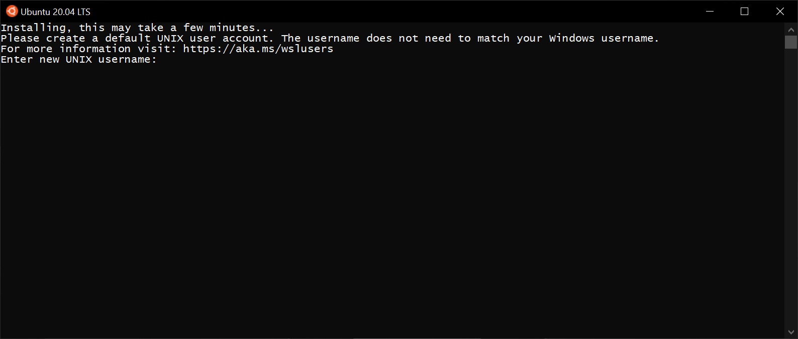
</div>

Go ahead and make a username and password. _Note that, when typing out your password, the characters you're typing will be hidden from you. Type carefully!_ Most command-line tools that ask for passwords will do this. This is a password you'll be using a lot, so I recommend making it somewhat short and memorable. 

After setting a username and password, you should now have your Linux distribution ready-to-go! Here is what my console looks like after setting a username and password:

<div align="center">
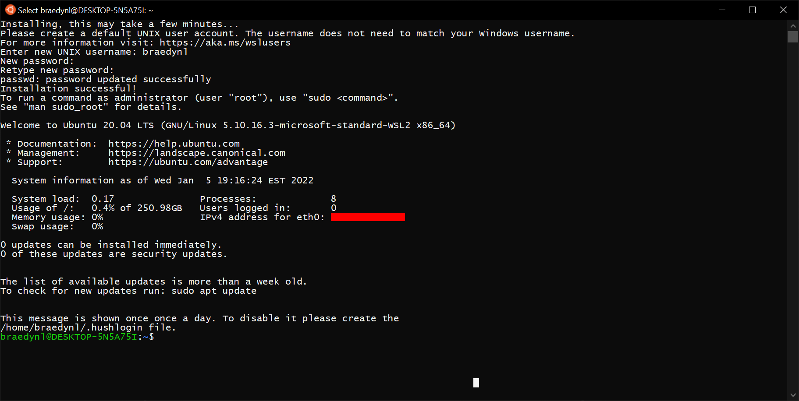
</div>

This thing here: `braedynl@DESKTOP-5N5A75I:~$` is the prompt. Mine will be slightly different from yours; the format it follows is roughly:

```
{Your username}@{Your computer's name}:{Your current working directory}$
```

By default, opening the distribution console will place you in your "home directory" (represented by the tilde symbol, `~`). The actual path of your home directory is

```
/home/{Your username}
```

Which you can see by using the command `pwd`.

Next lets update the installed software on the linux box. Run this command:

```bash
sudo apt update
```
Then run:
```bash
sudo apt upgrade
```


Let's now install our compiler. This can be done simply by executing the command:

```bash
sudo apt install g++
```

This will ask you for the password you setup earlier. Again, bear in mind that the characters you type for the password prompt will be hidden from you.

Your terminal will populate with _a lot_ of junk after this. You'll be asked if you want to continue; type `Y` and hit ENTER to confirm.

<div align="center">
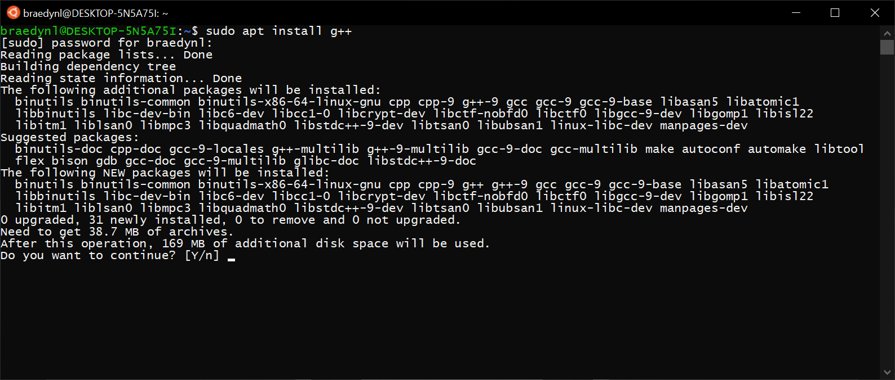
</div>

**Note**: if you get a bunch of "failed to fetch" errors, run the command: `sudo apt-get update`, then try running the installation command for `g++` again.

Your terminal will look something like this by the end of the installation:

<div align="center">
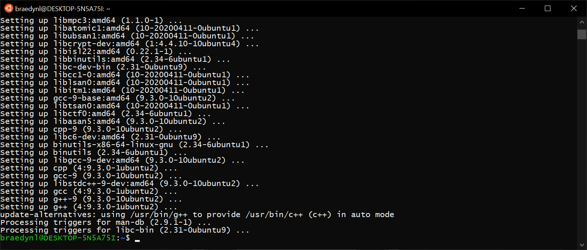
</div>

We now have access to Linux command-line tools and a C++ compiler. We're not done yet, though. Let's now get Visual Studio Code installed and working with WSL.

I recommend keeping this instance of your Linux terminal open for the next series of steps.

## Preparing VSCode for C++

**Important**: when prompted to "Select Additional Tasks" during this first installation, be sure that the "**Add to PATH**" option is checked **on** (it should already be checked on):

[Download and install the Stable version of Visual Studio Code here.](https://code.visualstudio.com/)

Open VSCode and click on the icon of four squares to the left sidebar. This will open the VSCode Extensions Marketplace. Search for "remote development", and the first result should be an extension of the same name, made by Microsoft.

<div align="center">
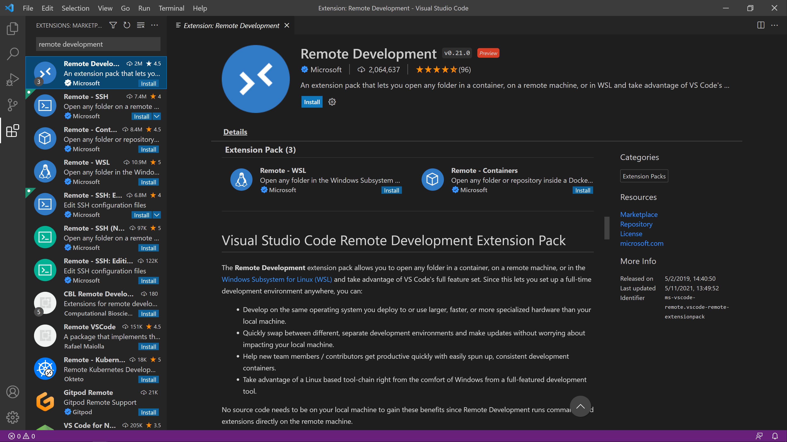
</div>

Go ahead and hit the top **Install** button.

Close out of the VSCode instance you were just using to install the Remote Development extension, and bring up your Linux terminal.

In your terminal: stay at, or navigate to the home directory (execute `cd ~` if you're not there).

Run the command: `code .` (note the space-separated period following the word "code"), and you should see the terminal unpack some items and launch a new VSCode instance. This unpacking is a one-time thing; it will normally open a VSCode window instantaneously.

If you get a "command not found" error, close and re-open the Ubuntu app.

<div align="center">
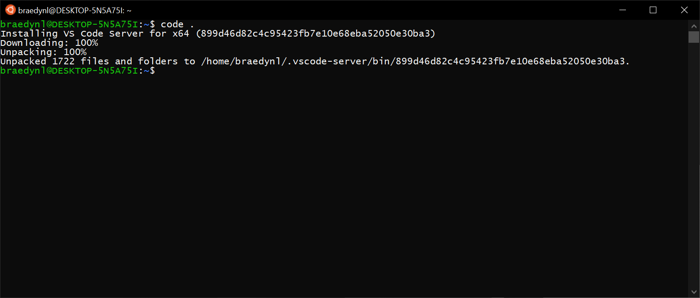
</div>

<div align="center">
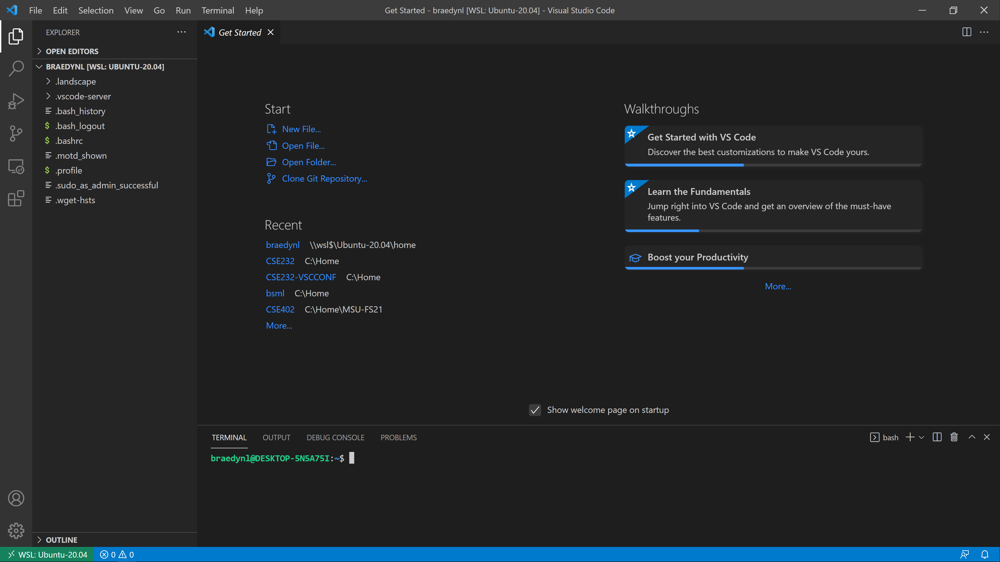
</div>

You should now see these files when opening the integrated explorer, with the integrated terminal showing your Linux distribution prompt (for Ubuntu, the shell that is being ran is called "bash"). If the integrated terminal didn't appear, use the key combination CTRL + ` (this is the backtick character, left of the 1 key on most keyboards) to toggle the terminal.

Once again navigate to the Extensions Marketplace, and now search for "C/C++". You should, again, find an extension of the same name developed by Microsoft.

<div align="center">
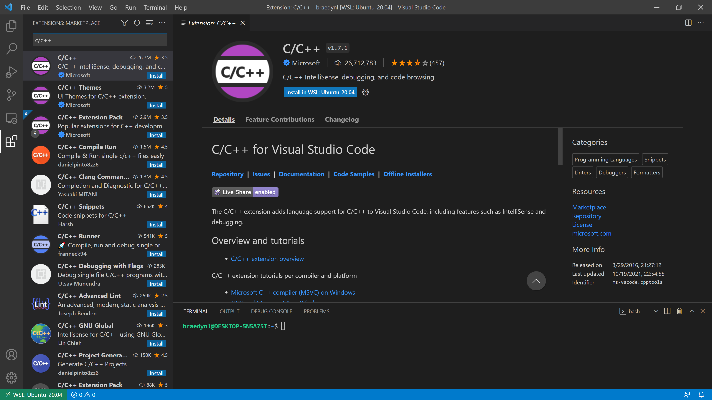
</div>

Hit the **Install in WSL: Ubuntu-20.04** button once you're there. Note that we're _not_ installing the "C/C++ Extension Pack". It comes with a lot of extra stuff that we will not be using in this course.

Once the extension has been installed, navigate back to the integrated file explorer (the top icon, the files stacked onto one another), and right-click the panel in an open space. You'll find that you have many of the options you'd normally have in File Explorer:

<div align="center">
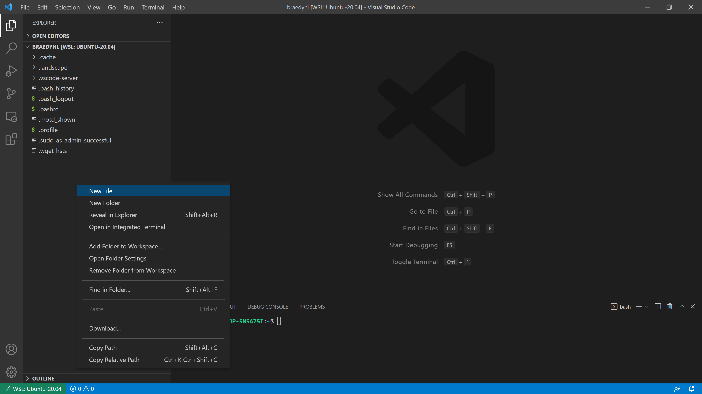
</div>

Create a new file called "helloworld.cpp", and type/copy-paste the following code into it:

```c++
#include <iostream>

int main()
{
    std::cout << "Hello world" << std::endl;
}
```

The terminal is where you compile your C++ source code. Most labs will have short sections dedicated to learning more about the terminal, as you'll need to be comfortable with it for general navigation and future coursework. Save your helloworld.cpp file if you haven't already (CTRL + S), and in order to compile our lovely program, type the following command into the terminal:

```bash
g++ helloworld.cpp -Wall -std=c++20
```

This produces a file named "a.out" – you should see it appear in the file explorer. To run your compiled program, type into the terminal:

```bash
./a.out
```

And you should then see "Hello world" displayed to the console!

<div align="center">
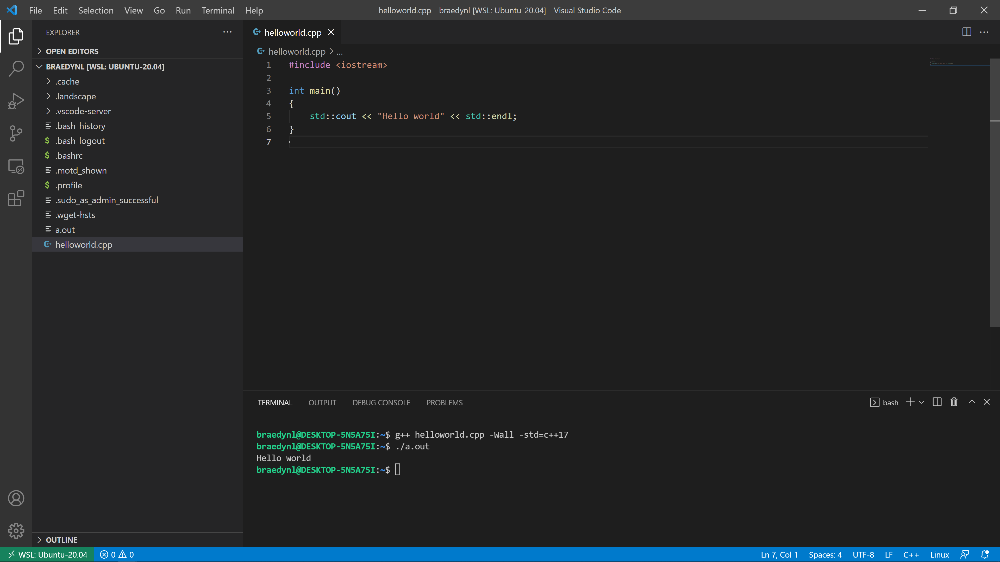
</div>

<div align="center">
<p>Congratulations! You just made your first program in C++.</p>
</div>

It's important to note that **you must compile your program and run a.out every time you want to test your code**. You will be typing those two commands hundreds of times in this course. Keep them in your notes or memorize them (you'll likely have them memorized within a few days of practice).

If you setup the debugger (the section below), you can compile and run in a single mouse-click. We'll be talking more about the compilation command and what you can do with it, though, so it's best to be familiar with both.

**Note**: I _strongly_ recommend you setup the debugger now, and use it to your advantage throughout this course. It is incredibly helpful once you get the hang of it.

## Debugging C++ in VSCode

You should be familiar with an IDE debugger from your previous programming class (CSE 231 or an equivalent prerequisite). [If you aren't, please read through this tutorial](../debugging_guide.html) (it's in Python, but the same core principles apply).

Like we did to install our compiler, `g++`, we need to install a debugger. Type the following command into the terminal (I would use the integrated one in VSCode, just a lot easier to keep everything together there):

```bash
sudo apt install gdb
```

Approve the installation as necessary.

In order to use `gdb` with VSCode (using `gdb` by itself will be something you learn later in this course), we need to grab some configuration files.

Execute the following command to install a special GDB configuration file:

```bash
curl -o ~/.gdbinit https://raw.githubusercontent.com/CSE232-MSU/CSE232-VSCCONF/main/gdbinit
```

Then, execute the following commands one-by-one to install the VSCode configuration files that allow VSCode to latch onto `gdb`:

```bash
mkdir .vscode
cd .vscode
curl --remote-name-all https://raw.githubusercontent.com/CSE232-MSU/CSE232-VSCCONF/main/windows/{launch.json,tasks.json}
cd ..
```

This will create a folder named ".vscode", containing some .json files. You'll also have a file named ".gdbinit".

<div align="center">
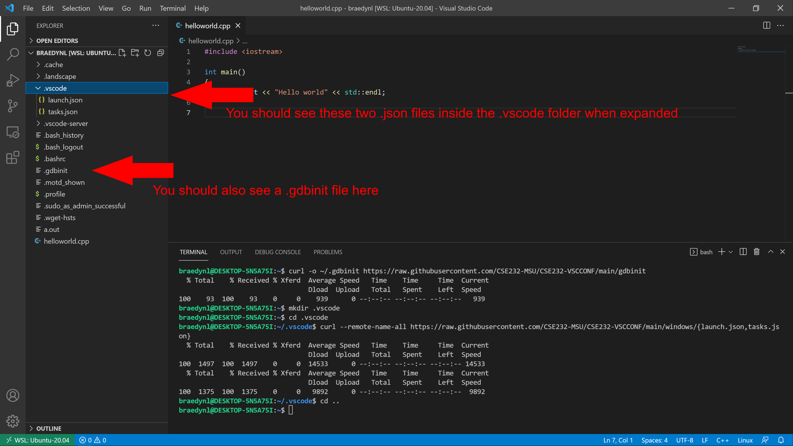
</div>

The .vscode folder is a special folder that VSCode will search for when performing certain tasks. The .vscode folder you just created by doing this process **is unique to the directory you're currently in, which is your home directory at the moment**. Moving VSCode to a new directory means that you will no longer have the same configurations. [You can reference the process we just ran through to install these configuration files here](https://github.com/CSE232-MSU/CSE232-VSCCONF), if you want to move your workspace to a different folder (this is also on the Setup home page). You can also just copy this .vscode folder around with you, if you move your workspace elsewhere.

Replace the contents of the helloworld.cpp file for this more complex version:

```c++
#include <iostream>
#include <vector>
#include <string>

int main()
{
    std::vector<std::string> msg{"Hello", "C++", "World", "from", "VS Code", "and the C++ extension!"};

    for (std::string const &word : msg)
    {
        std::cout << word << " ";
    }
    std::cout << std::endl;
}
```

You should see an icon on the left sidebar that looks like a play button with a bug on it – this is the debugger menu, go ahead and open it. Like most IDE debuggers, it has a menu showing your currently active variables, watched variables, call stack, and currently active breakpoints.

<div align="center">
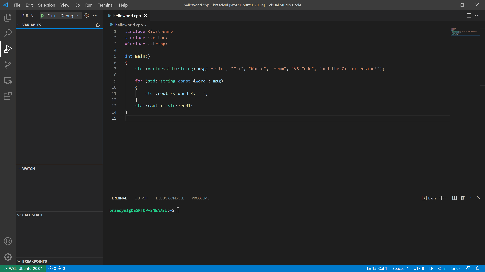
</div>

Set a breakpoint on the first line of the `main()` function by clicking slightly to the left of its line number; you should see a red dot appear. Then, execute the debugger by hitting the green play button at the top-left.

<div align="center">
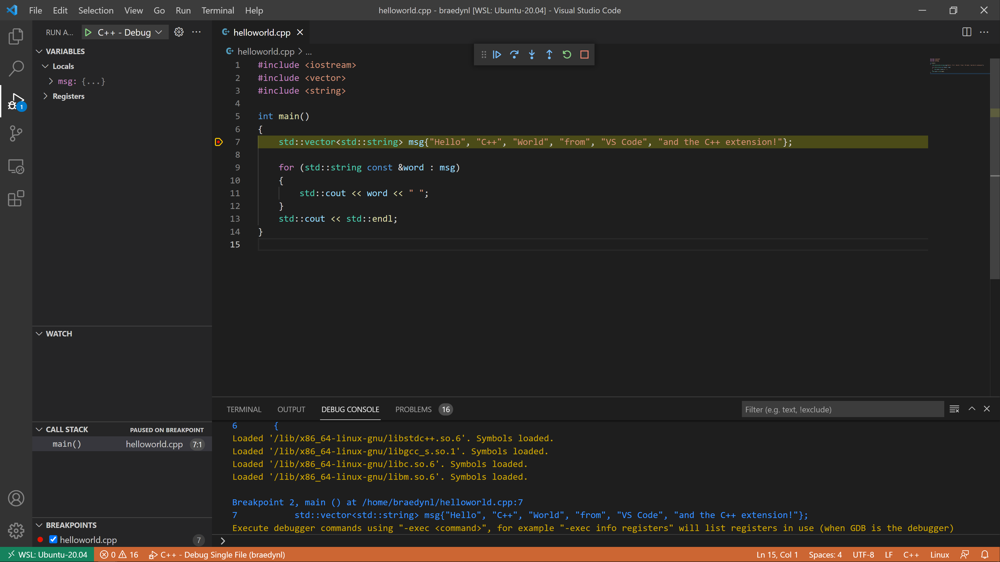
</div>

Your terminal should populate with commands that were automatically executed by the .vscode configuration I had you install. If your VSCode interface looks like mine in the screenshot above, then everything is working properly. Congrats!

The yellow-highlighted line shows the next line to be ran, as you could probably imagine.

At the top is the Debugger Control Panel:

<div align="center">

</div>

It includes your standard debugging options. In order from left to right:
- **Continue** - Run the program until next breakpoint
- **Step Over** - Run the highlighted line without stepping into the function call (if present)
- **Step Into** - Run the highlighted line and step into the function call (if present)
- **Step Out** - Step out of a function call (if inside a function body)
- **Restart** - Re-execute the program with the debugger active
- **Stop** - Exit the debugger

The rectangle of dots on the left-side of the panel is a drag-point, where you can click and hold to drag the panel elsewhere in the window.

After defining the `msg` variable by stepping, you can click its dropdown inside the debugger menu to see its contents denoted by index.

<div align="center">
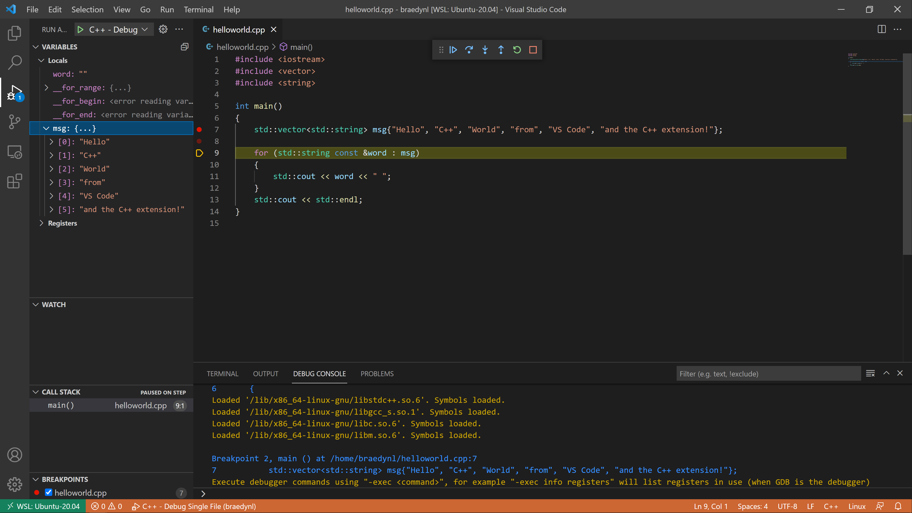
</div>

The `std::vector` and `std::string` classes are things you'll learn at a later date.

Your debugger is now ready-to-go! Included with the .vscode folder are two debugging configurations: single file, and multi file. You can choose the configuration by hitting the dropdown menu next to the green play button. You won't need to worry about multi-file compilation for a few weeks, yet.

## Closing Notices

Throughout this tutorial, we've been doing everything in your Linux distribution's _home directory_ (the directory represented by the `~` symbol). This folder has some significance that we'll be talking about in later labs. The folders and files that were present at the opening of VSCode **should not be deleted**. Most of them are configuration files for your shell.

The reason we did everything in here is for sake of simplicity. It's likely that you have little or no knowledge of how to navigate folders with the terminal, and so everything was kept at the home directory to avoid needing to teach you about terminal navigation (which will be the first lab's lesson).

You now have Visual Studio Code, however, which _does_ provide a somewhat graphical view of the surrounding filesystem, if you want to play around and move your workspace (I, personally, have a CSE 232 folder in my home directory that I work from). You can move workspaces by going to the **File** tab at the top, and hitting **Open Folder**. A listing of folder contents will be provided with a sub-menu that appears. The **..** syntax that you'll see represents the parent folder.

If you log-off from your computer and want to come back to VSCode at this folder, always remember that you have to boot-up the Ubuntu app (or whatever Linux distribution app you have), then use the command `code .`. The `.` tells the command to open VSCode at the terminal's current location.
